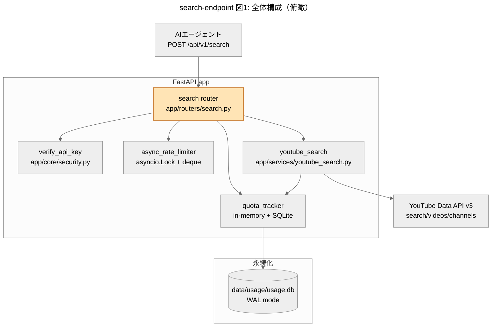
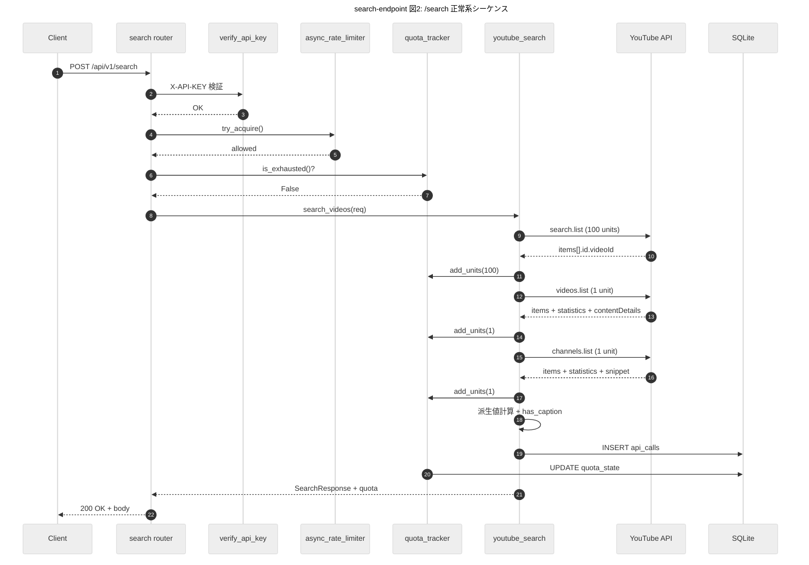
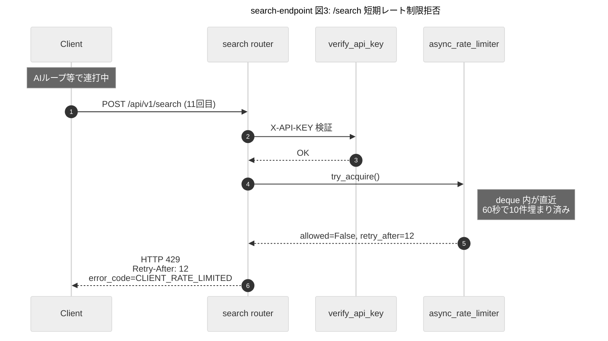
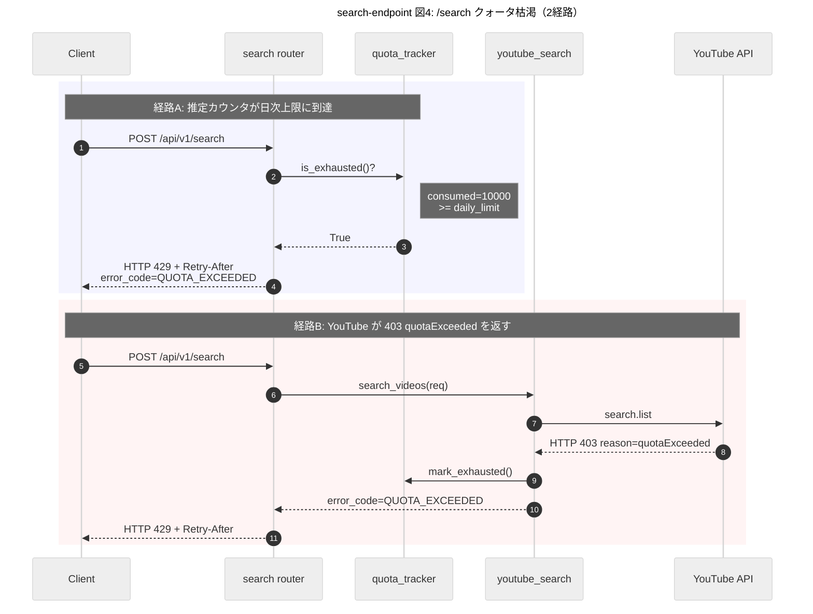
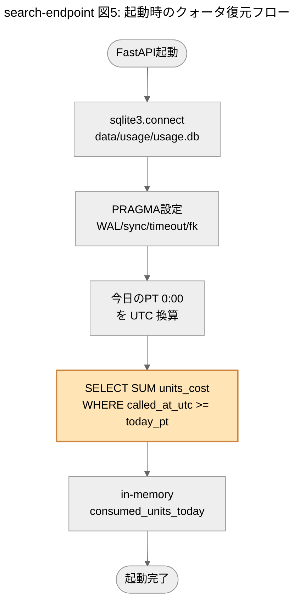
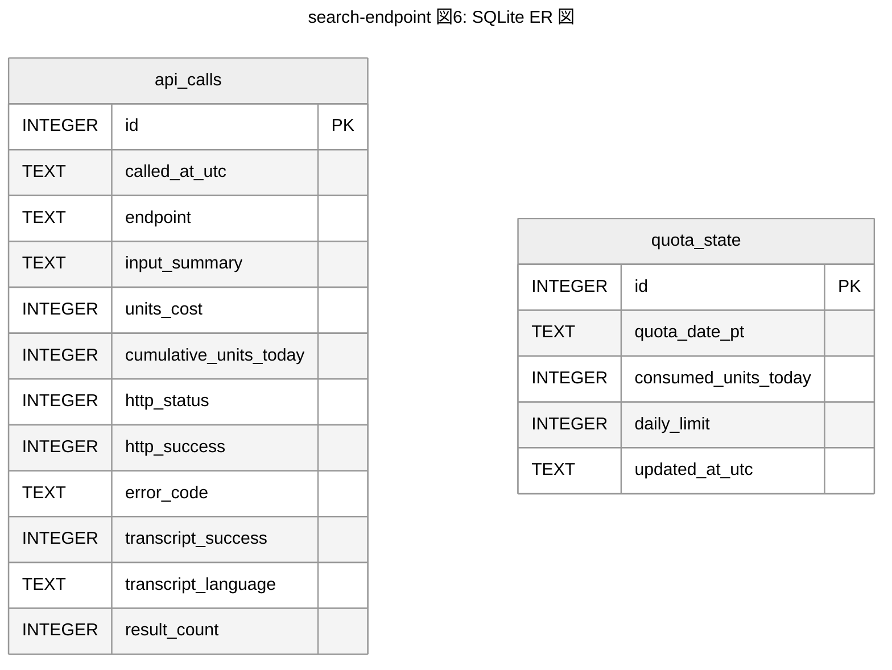
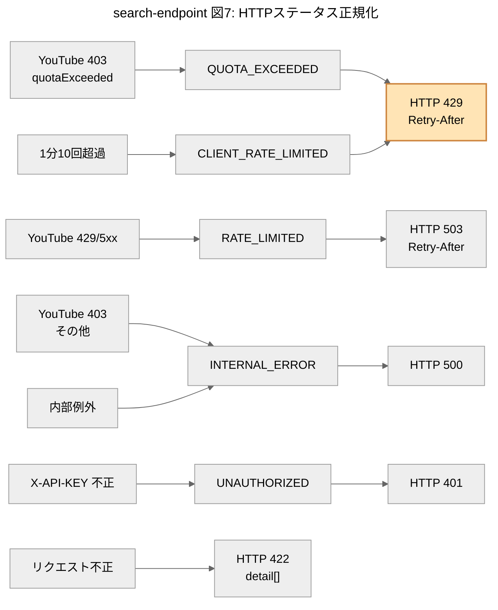

# 設計書: POST /api/v1/search エンドポイント追加 — TDD（MVP）

> 対応する要件書: `.kiro/specs/search-endpoint/requirements.md`
> 関連: `docs/expert-reviews/2026-04-25-search-endpoint-design-review.md`（技術判断の根拠）

## 1. 概要

### 1.1 目的とスコープ

YouTube Summary API に新規エンドポイント `POST /api/v1/search` を追加し、CLI 上の AI エージェントが信憑性指標付きで動画を検索できるようにする。本書は **テスト駆動開発（TDD）** の前提で書かれており、各機能の実装に先立って書くべきテストケースを明示する。

### 1.2 MVP / Phase 2 の境界

| 項目 | 受け入れ基準 # | 本書での扱い |
|---|---|---|
| /search エンドポイント本体（成功・全エラー） | #1〜#5, #7 | **MVP** |
| クォータ追跡（プロセス内 + SQLite 永続化、起動時 SUM 復元） | #8, #14, #15 | **MVP** |
| クォータ枯渇判定（推定到達 + 403 quotaExceeded 受信） | #10 | **MVP** |
| 短期レート制限（asyncio.Lock + sliding window） | #9, #12 | **MVP** |
| HTTP ステータス正規化（401/422/429/503/500） | #1, #3, #9, #10 | **MVP** |
| SQLite PRAGMA（WAL/synchronous/busy_timeout/foreign_keys） | #13 | **MVP** |
| /summary レスポンスへの `quota` 注入（後方互換） | #6, #8, #17 | **MVP** |
| `.gitignore` に `data/usage/` 追加 | #16 | **MVP** |
| 全モック単体・統合テスト | #18 | **MVP** |
| transcript 完全除外（構造的に取れない） | #6 | **MVP** |
| DST 境界テスト（2026-03-08 / 2026-11-01） | #11 | **Phase 2** |
| スキーマスナップショット（`tests/snapshots/`） | #19 | **Phase 2** |
| 任意ライブテスト（`tests/live/`、`RUN_LIVE_YOUTUBE_TESTS=1`） | #20 | **Phase 2** |

> 補足: コード上は `zoneinfo("America/Los_Angeles")` を使うので、DST 切替は **標準ライブラリが自動的に正しく扱う**。Phase 2 のタスクは「境界をテストで明示的に固定する」ガード追加であり、機能の正しさはこれが無くても担保される。

---

## 2. アーキテクチャ

### 2.1 全体構成



### 2.2 ファイル構成（新規/変更）

```
app/
├── core/
│   ├── constants.py              [変更] 定数追加、CHANNELS_PART を snippet,statistics に
│   ├── quota_tracker.py          [新規]
│   └── async_rate_limiter.py     [新規]
├── models/
│   └── schemas.py                [変更] SummaryResponse に quota 追加
│                                        SearchRequest/SearchResult/SearchResponse/Quota 新規
├── routers/
│   ├── summary.py                [変更] quota 集計を挟む（既存挙動・既存フィールド不変）
│   └── search.py                 [新規]
└── services/
    ├── youtube.py                [変更] consumed_units 加算、channels.list の snippet パース追加
    └── youtube_search.py         [新規]

main.py                           [変更] /search ルータ include
.gitignore                        [変更] data/usage/ 追加

data/
└── usage/
    └── usage.db                  [新規・gitignore対象] SQLite

tests/
├── test_search_schemas.py        [新規]
├── test_quota_tracker.py         [新規]
├── test_async_rate_limiter.py    [新規]
├── test_search_service.py        [新規]
├── test_search_endpoint.py       [新規]
├── test_summary_quota_injection.py [新規]
└── conftest.py                   [変更] search 系 fixture 追加
```

### 2.3 既存資産の再利用

| 既存資産 | 場所 | 新規での利用先 |
|---|---|---|
| `_call_youtube_api_with_retry(url, params) -> ApiCallResult` | `app/services/youtube.py` | `youtube_search` で 3 種 API 全て |
| `_extract_api_error_reason(error_body) -> str \| None` | 同上 | 403 quotaExceeded 判定 |
| `_classify_api_error(status_code, error_body) -> str` | 同上 | 4xx 分類 |
| `_parse_iso8601_duration(s) -> int \| None` | 同上 | `duration` 秒数化 |
| `_format_duration_string(secs) -> str \| None` | 同上 | `duration_string` |
| `_select_best_thumbnail(thumbs) -> str \| None` | 同上 | `thumbnail_url` 選定 |
| `_to_int_or_none(v) -> int \| None` | 同上 | YouTube API の文字列数値 → int |
| `YOUTUBE_CATEGORY_MAP` | `app/core/constants.py` | `category` 名前変換 |
| `verify_api_key` | `app/core/security.py` | `Depends(verify_api_key)` |
| `_resp(status_code, payload)` パターン | テスト | search 系テストにも転用 |

---

## 3. モジュール設計

### 3.1 `app/core/constants.py` 拡張

```python
# --- エラーコード（追加） ---
ERROR_QUOTA_EXCEEDED = "QUOTA_EXCEEDED"
ERROR_UNAUTHORIZED = "UNAUTHORIZED"

# --- /search 用レート制限 ---
SEARCH_RATE_LIMIT_WINDOW_SECONDS = 60
SEARCH_RATE_LIMIT_MAX_REQUESTS = 10

# --- メッセージ（追加） ---
MSG_UNAUTHORIZED = "X-API-KEY ヘッダが不正または未設定です。"
MSG_QUOTA_EXCEEDED_TEMPLATE = (
    "YouTube Data API の日次クォータ({daily_limit} units)を使い切りました。"
    "あと {reset_in_seconds} 秒(JST {reset_jst} に)リセットされます。"
)
MSG_SEARCH_CLIENT_RATE_LIMITED_TEMPLATE = (
    "検索レート制限: 直近{window}秒で{max_req}回を超えました。"
    "ルール: {window}秒あたり最大{max_req}回。{retry_after}秒後に再試行してください。"
)

# --- YouTube Data API v3（追加・変更） ---
YOUTUBE_API_V3_SEARCH_URL = "https://www.googleapis.com/youtube/v3/search"
YOUTUBE_API_V3_SEARCH_PART = "snippet"
YOUTUBE_API_V3_SEARCH_TYPE = "video"
YOUTUBE_API_V3_SEARCH_MAX_RESULTS = 50
YOUTUBE_API_V3_VIDEOS_BATCH_SIZE = 50
YOUTUBE_API_V3_CHANNELS_BATCH_SIZE = 50

# 変更: snippet を追加（channel_created_at = snippet.publishedAt 取得のため）
YOUTUBE_API_V3_CHANNELS_PART = "snippet,statistics"

# --- クォータ ---
YOUTUBE_DAILY_QUOTA_LIMIT = 10_000
QUOTA_COST_SEARCH_LIST = 100
QUOTA_COST_VIDEOS_LIST = 1
QUOTA_COST_CHANNELS_LIST = 1

# --- SQLite ---
USAGE_DB_PATH = "data/usage/usage.db"
```

### 3.2 `app/core/quota_tracker.py`（新規）

責務: クォータ消費の累計をプロセス内に保持しつつ、SQLite へ永続化。PT 0:00 跨ぎで 0 にリセット。

```python
"""クォータ消費の追跡（プロセス内 + SQLite 永続化）。"""

import sqlite3
import threading
from collections import namedtuple
from datetime import datetime, time, timedelta, timezone
from pathlib import Path
from zoneinfo import ZoneInfo

PT = ZoneInfo("America/Los_Angeles")

QuotaSnapshot = namedtuple(
    "QuotaSnapshot",
    ["consumed_units_today", "remaining_units_estimate", "daily_limit",
     "reset_at_utc", "reset_at_jst", "reset_in_seconds", "is_exhausted"],
)

# プロセス内状態（threading.Lock で保護）
_state = {
    "consumed_units_today": 0,
    "quota_date_pt": None,           # str: "2026-04-25"
    "exhausted_until": None,         # datetime | None: 403 受信時に強制 exhausted
    "last_call_cost": 0,
}
_lock = threading.Lock()
_db_path: Path | None = None  # init() で設定


def init(db_path: Path) -> None:
    """SQLite を初期化し、PRAGMA を設定し、起動時の SUM 復元を行う。"""

def add_units(cost: int) -> None:
    """API 呼び出し成功時に units を加算。SQLite api_calls/quota_state も更新。"""

def is_exhausted(now_utc: datetime | None = None) -> bool:
    """日次クォータが枯渇しているか（推定 or 403 強制）。PT 0:00 跨ぎで自動リセット。"""

def mark_exhausted(reason: str = "youtube_403") -> None:
    """YouTube 403 quotaExceeded 受信時に呼ぶ。次の PT 0:00 まで枯渇扱い。"""

def get_snapshot(now_utc: datetime | None = None) -> QuotaSnapshot:
    """現在のクォータ状態を返す（レスポンスの quota フィールド組み立て用）。"""

def reset() -> None:
    """テスト用: プロセス内状態と SQLite を初期化。"""

def _next_pt_midnight_utc(now_utc: datetime) -> datetime:
    """次の PT 0:00 を UTC で返す。zoneinfo が DST 自動処理。"""
    now_pt = now_utc.astimezone(PT)
    next_day_pt = datetime.combine(
        now_pt.date() + timedelta(days=1), time.min, tzinfo=PT
    )
    return next_day_pt.astimezone(timezone.utc)

def _today_pt_midnight_utc(now_utc: datetime) -> datetime:
    """今日（PT基準）の 0:00 を UTC で返す。SUM クエリの境界に使用。"""
    now_pt = now_utc.astimezone(PT)
    today_midnight_pt = datetime.combine(now_pt.date(), time.min, tzinfo=PT)
    return today_midnight_pt.astimezone(timezone.utc)

def _connect() -> sqlite3.Connection:
    """PRAGMA を設定して接続を返す。"""
```

#### SQLite 接続の PRAGMA（TC-3 反映）

```python
def _connect() -> sqlite3.Connection:
    conn = sqlite3.connect(str(_db_path), timeout=5.0, isolation_level=None)
    conn.execute("PRAGMA journal_mode=WAL;")
    conn.execute("PRAGMA synchronous=NORMAL;")
    conn.execute("PRAGMA busy_timeout=5000;")
    conn.execute("PRAGMA foreign_keys=ON;")
    return conn
```

#### 書き込みは BEGIN IMMEDIATE で

```python
def _write_atomic(stmts: list[tuple[str, tuple]]) -> None:
    conn = _connect()
    try:
        conn.execute("BEGIN IMMEDIATE;")
        for sql, params in stmts:
            conn.execute(sql, params)
        conn.execute("COMMIT;")
    except Exception:
        conn.execute("ROLLBACK;")
        raise
    finally:
        conn.close()
```

### 3.3 `app/core/async_rate_limiter.py`（新規）

責務: `/search` 用の sliding window レート制限（直近 60 秒で 10 回まで）。`asyncio.Lock` を使用（TC-4）。

```python
"""非同期スライディングウィンドウ・レート制限。"""

import asyncio
from collections import deque

from app.core.constants import (
    SEARCH_RATE_LIMIT_MAX_REQUESTS,
    SEARCH_RATE_LIMIT_WINDOW_SECONDS,
)


class AsyncSlidingWindow:
    def __init__(self, max_calls: int, window_sec: float):
        self._max = max_calls
        self._window = window_sec
        self._calls: deque[float] = deque()
        self._lock = asyncio.Lock()

    async def try_acquire(self, now: float | None = None) -> tuple[bool, int]:
        """(allowed, retry_after_seconds) を返す。retry_after は最低 1。"""

    async def reset(self) -> None:
        """テスト用。"""


# /search 専用のシングルトン
search_rate_limiter = AsyncSlidingWindow(
    max_calls=SEARCH_RATE_LIMIT_MAX_REQUESTS,
    window_sec=SEARCH_RATE_LIMIT_WINDOW_SECONDS,
)
```

### 3.4 `app/models/schemas.py` 拡張

```python
from datetime import datetime
from pydantic import BaseModel, ConfigDict, Field, computed_field, model_validator


class Quota(BaseModel):
    """API クォータ状態（レスポンス同梱用）。"""
    model_config = ConfigDict(frozen=True, extra="forbid")

    consumed_units_today: int
    daily_limit: int = 10_000
    last_call_cost: int
    reset_at_utc: datetime
    reset_at_jst: datetime

    @computed_field
    @property
    def remaining_units_estimate(self) -> int:
        return max(0, self.daily_limit - self.consumed_units_today)

    @computed_field
    @property
    def reset_in_seconds(self) -> int:
        from datetime import timezone
        delta = (self.reset_at_utc - datetime.now(timezone.utc)).total_seconds()
        return max(0, int(delta))


class SearchRequest(BaseModel):
    """POST /api/v1/search リクエストボディ。"""
    model_config = ConfigDict(extra="forbid")

    q: str = Field(..., min_length=1, description="検索クエリ（必須）")
    order: str | None = Field(None, pattern="^(relevance|date|rating|viewCount|title)$")
    published_after: datetime | None = None
    published_before: datetime | None = None
    video_duration: str | None = Field(None, pattern="^(any|short|medium|long)$")
    region_code: str | None = Field(None, pattern="^[A-Z]{2}$")
    relevance_language: str | None = Field(None, pattern="^[a-z]{2}$")
    channel_id: str | None = None


class SearchResult(BaseModel):
    """検索結果 1 件分。"""
    model_config = ConfigDict(frozen=True, extra="forbid")

    video_id: str
    title: str
    channel_name: str
    channel_id: str
    upload_date: str | None
    thumbnail_url: str | None
    webpage_url: str
    description: str
    tags: list[str] | None
    category: str | None
    duration: int | None
    duration_string: str | None
    has_caption: bool
    definition: str | None  # "hd" / "sd"

    view_count: int | None
    like_count: int | None
    like_view_ratio: float | None
    comment_count: int | None
    comment_view_ratio: float | None

    channel_follower_count: int | None
    channel_video_count: int | None
    channel_total_view_count: int | None
    channel_created_at: str | None
    channel_avg_views: int | None


class SearchResponse(BaseModel):
    """POST /api/v1/search レスポンス。"""
    model_config = ConfigDict(extra="forbid")

    success: bool
    message: str
    error_code: str | None = None
    query: str | None = None
    total_results_estimate: int | None = None
    returned_count: int | None = None
    results: list[SearchResult] | None = None
    retry_after: int | None = None
    quota: Quota | None = None  # 401/422 では None

    @computed_field
    @property
    def status(self) -> str:
        return "ok" if self.success else "error"

    @model_validator(mode="after")
    def _check_error_correlation(self):
        if self.success and self.error_code is not None:
            raise ValueError("success=True なら error_code は None")
        if not self.success and self.error_code is None:
            raise ValueError("success=False なら error_code は必須")
        return self
```

`SummaryResponse` への変更（既存・追加のみ）:

```python
class SummaryResponse(BaseModel):
    # ...既存フィールド全て不変...
    quota: Quota | None = None  # ← 新規追加（既存 22 項目は不変）
```

### 3.5 `app/services/youtube_search.py`（新規）

```python
"""YouTube Data API v3 の search.list を中心とした検索サービス。"""

import logging
import os
import time
from datetime import datetime, timezone
from itertools import batched
from typing import NamedTuple

from app.core import quota_tracker
from app.core.constants import (
    QUOTA_COST_CHANNELS_LIST, QUOTA_COST_SEARCH_LIST, QUOTA_COST_VIDEOS_LIST,
    YOUTUBE_API_V3_CHANNELS_BATCH_SIZE, YOUTUBE_API_V3_CHANNELS_PART,
    YOUTUBE_API_V3_CHANNELS_URL, YOUTUBE_API_V3_SEARCH_MAX_RESULTS,
    YOUTUBE_API_V3_SEARCH_PART, YOUTUBE_API_V3_SEARCH_TYPE, YOUTUBE_API_V3_SEARCH_URL,
    YOUTUBE_API_V3_VIDEOS_BATCH_SIZE, YOUTUBE_API_V3_VIDEOS_PART,
    YOUTUBE_API_V3_VIDEOS_URL,
)
from app.models.schemas import SearchRequest, SearchResponse, SearchResult
from app.services.youtube import (
    _call_youtube_api_with_retry, _extract_api_error_reason,
    _format_duration_string, _parse_iso8601_duration,
    _select_best_thumbnail, _to_int_or_none,
)

logger = logging.getLogger(__name__)


def search_videos(req: SearchRequest) -> SearchResponse:
    """公開エントリーポイント。常に SearchResponse を返す（例外を投げない）。"""


# 内部関数 ↓

def _build_search_params(req: SearchRequest, api_key: str) -> dict:
    """search.list 用の query parameters を組み立てる。"""

def _call_search_list(req: SearchRequest, api_key: str) -> tuple[list[dict], str | None]:
    """search.list を呼ぶ。(items, error_code) を返す。"""

def _call_videos_list(video_ids: list[str], api_key: str) -> tuple[dict[str, dict], str | None]:
    """videos.list をバッチで呼ぶ。{video_id: item} の dict と (error_code) を返す。"""

def _call_channels_list(channel_ids: list[str], api_key: str) -> tuple[dict[str, dict], str | None]:
    """channels.list をバッチで呼ぶ。{channel_id: item} の dict と (error_code) を返す。"""

def _build_search_result(
    search_item: dict, video_item: dict | None, channel_item: dict | None
) -> SearchResult:
    """3 つの API 結果を結合して 1 件の SearchResult を組み立てる。"""

def _calc_ratio(numer: int | None, denom: int | None) -> float | None:
    """divisor が 0 / None なら None。それ以外は numer/denom を float で返す。"""

def _parse_caption_flag(value: str | None) -> bool:
    """contentDetails.caption の "true"/"false"/None を bool に。None や不正値は False。"""

def _record_api_call(
    endpoint: str, input_summary: str, units_cost: int,
    http_status: int, error_code: str | None, result_count: int | None,
) -> None:
    """SQLite api_calls にログ INSERT。quota_tracker 経由で書き込む。"""
```

### 3.6 `app/routers/search.py`（新規）

```python
"""POST /api/v1/search エンドポイント。"""

import logging

from fastapi import APIRouter, Depends, HTTPException, Request

from app.core import quota_tracker
from app.core.async_rate_limiter import search_rate_limiter
from app.core.constants import (
    ERROR_CLIENT_RATE_LIMITED, ERROR_QUOTA_EXCEEDED,
    MSG_SEARCH_CLIENT_RATE_LIMITED_TEMPLATE, MSG_QUOTA_EXCEEDED_TEMPLATE,
    SEARCH_RATE_LIMIT_MAX_REQUESTS, SEARCH_RATE_LIMIT_WINDOW_SECONDS,
)
from app.core.security import verify_api_key
from app.models.schemas import SearchRequest, SearchResponse
from app.services.youtube_search import search_videos

logger = logging.getLogger(__name__)
router = APIRouter(prefix="/api/v1", tags=["Search"])


@router.post("/search", response_model=SearchResponse)
async def search(
    request: Request,
    body: SearchRequest,
    _: str = Depends(verify_api_key),
) -> SearchResponse:
    """
    検索フローの責務:
    1. レート制限チェック → 拒否時 HTTP 429 + Retry-After
    2. クォータ枯渇チェック → 該当時 HTTP 429 + Retry-After
    3. サービス層に委譲
    4. レスポンスに quota を同梱
    """
```

### 3.7 既存ファイルへの変更

#### `app/routers/summary.py`

```python
# 変更箇所のみ抜粋（既存挙動・既存フィールドは不変）
from app.core import quota_tracker

@router.post("/summary", response_model=SummaryResponse)
async def get_summary(...):
    # ... 既存処理 ...
    response_data = get_summary_data(video_url=video_url)
    # 追加: quota フィールドを同梱
    response_data.quota = quota_tracker.get_snapshot()
    return response_data
```

#### `app/services/youtube.py`

`channels.list` の `snippet` パース追加（既存ロジック不変、追加のみ）:

```python
# _build_metadata_from_youtube_api 内、既存に加えて
# channel_created_at を取得（channel_data["snippet"]["publishedAt"]）— ただし
# ここは既存 SummaryResponse 用で channel_created_at は使わないため、
# search 側で別途パースする想定でも可。実装時に判断。
```

`_call_youtube_api_with_retry` の呼び出し成功時に `quota_tracker.add_units(cost)` を加算する（既存箇所の修正、対応コスト分）。

#### `main.py`

```python
from app.routers import search as search_router
from app.routers import summary as summary_router

app.include_router(summary_router.router)
app.include_router(search_router.router)  # 追加

# 起動イベントでクォータ追跡を初期化
@app.on_event("startup")
async def _startup() -> None:
    from pathlib import Path
    from app.core import quota_tracker
    from app.core.constants import USAGE_DB_PATH
    Path(USAGE_DB_PATH).parent.mkdir(parents=True, exist_ok=True)
    quota_tracker.init(Path(USAGE_DB_PATH))
```

#### `.gitignore`

```
# 既存に追加
data/usage/
```

---

## 4. データフロー

### 4.1 正常系シーケンス



### 4.2 短期レート制限拒否



### 4.3 クォータ枯渇



### 4.4 SQLite 永続化と起動時 SUM 復元



---

## 5. SQLite スキーマ

### 5.1 ER 図



### 5.2 `api_calls` DDL

```sql
CREATE TABLE IF NOT EXISTS api_calls (
    id                       INTEGER PRIMARY KEY AUTOINCREMENT,
    called_at_utc            TEXT NOT NULL,                    -- ISO 8601
    endpoint                 TEXT NOT NULL,                    -- 'search' | 'summary'
    input_summary            TEXT,                             -- q or video_id
    units_cost               INTEGER NOT NULL DEFAULT 0,
    cumulative_units_today   INTEGER NOT NULL DEFAULT 0,
    http_status              INTEGER NOT NULL,
    http_success             INTEGER NOT NULL,                 -- 0/1
    error_code               TEXT,
    transcript_success       INTEGER,                          -- summary のみ、それ以外 NULL
    transcript_language      TEXT,
    result_count             INTEGER                            -- search のみ
);
CREATE INDEX IF NOT EXISTS idx_api_calls_called_at ON api_calls(called_at_utc);
```

### 5.3 `quota_state` DDL（単一行制約）

```sql
CREATE TABLE IF NOT EXISTS quota_state (
    id                      INTEGER PRIMARY KEY CHECK (id = 1),
    quota_date_pt           TEXT NOT NULL,                     -- 'YYYY-MM-DD' (PT 基準)
    consumed_units_today    INTEGER NOT NULL DEFAULT 0,
    daily_limit             INTEGER NOT NULL DEFAULT 10000,
    updated_at_utc          TEXT NOT NULL
);
```

### 5.4 接続初期化 PRAGMA（TC-3）

```python
conn = sqlite3.connect(db_path, timeout=5.0, isolation_level=None)
conn.execute("PRAGMA journal_mode=WAL;")
conn.execute("PRAGMA synchronous=NORMAL;")
conn.execute("PRAGMA busy_timeout=5000;")
conn.execute("PRAGMA foreign_keys=ON;")
```

### 5.5 起動時 SUM 復元

```python
def _restore_consumed_units(now_utc: datetime) -> int:
    today_pt_midnight_utc = _today_pt_midnight_utc(now_utc)
    conn = _connect()
    try:
        row = conn.execute(
            "SELECT COALESCE(SUM(units_cost), 0) FROM api_calls "
            "WHERE called_at_utc >= ?",
            (today_pt_midnight_utc.isoformat(),),
        ).fetchone()
        return int(row[0])
    finally:
        conn.close()
```

---

## 6. HTTP ステータス正規化

### 6.1 3 段階マップ



### 6.2 FastAPI で標準 HTTP を返す

`/search` のエラー応答は `HTTPException` ベースで返し、ボディは `SearchResponse` 互換 dict を `detail` に詰める方式ではなく、**カスタム exception handler** で `JSONResponse` を直接組み立てる方が読みやすい。

```python
from fastapi.responses import JSONResponse

def _error_response(
    http_status: int,
    error_code: str,
    message: str,
    quota: Quota | None,
    retry_after: int | None = None,
) -> JSONResponse:
    body = {
        "success": False,
        "status": "error",
        "error_code": error_code,
        "message": message,
        "results": None,
        "retry_after": retry_after,
        "quota": quota.model_dump(mode="json") if quota else None,
    }
    headers = {}
    if retry_after is not None:
        headers["Retry-After"] = str(retry_after)
    return JSONResponse(status_code=http_status, content=body, headers=headers)
```

`401` は `Depends(verify_api_key)` 内で `HTTPException(401, MSG_UNAUTHORIZED)` を投げ、グローバル handler で上記形式に整形する（ただし `quota=None`）。`422` は FastAPI 標準（`{"detail": [...]}`）をそのまま使う（`quota` 含めない）。

### 6.3 `/summary` は 200 固定

`/summary` の handler は本書の変更対象外（既存のまま）。レスポンスに `quota` を **追加するだけ**で、HTTP ステータスや既存フィールドは触らない。

---

## 7. 派生値計算とフィールドマッピング

### 7.1 派生値の計算

```python
def _calc_ratio(numer: int | None, denom: int | None) -> float | None:
    if denom is None or denom == 0 or numer is None:
        return None
    return round(numer / denom, 6)

# 利用例
like_view_ratio = _calc_ratio(like_count, view_count)
comment_view_ratio = _calc_ratio(comment_count, view_count)
channel_avg_views = (
    None if (video_count is None or video_count == 0 or total_view is None)
    else int(total_view / video_count)
)
```

### 7.2 `has_caption` の取得元

`videos.list(part=contentDetails)` のレスポンスで `contentDetails.caption` は **文字列 `"true"` / `"false"`** で返ってくる。

```python
def _parse_caption_flag(value: str | None) -> bool:
    return value == "true"
```

追加 API コスト 0 units（既存の `videos.list` 呼び出しで一緒に取れる）。

### 7.3 YouTube API → SearchResult のマッピング表

| SearchResult フィールド | 取得元 |
|---|---|
| `video_id` | `search.list.items[].id.videoId` |
| `title` | `search.list.items[].snippet.title` または `videos.list.items[].snippet.title` |
| `channel_name` | `videos.list.items[].snippet.channelTitle` |
| `channel_id` | `videos.list.items[].snippet.channelId` |
| `upload_date` | `videos.list.items[].snippet.publishedAt[:10]` |
| `thumbnail_url` | `videos.list.items[].snippet.thumbnails` → `_select_best_thumbnail` |
| `webpage_url` | `YOUTUBE_WATCH_URL_TEMPLATE.format(video_id=...)` |
| `description` | `videos.list.items[].snippet.description` |
| `tags` | `videos.list.items[].snippet.tags`（無ければ `None`） |
| `category` | `videos.list.items[].snippet.categoryId` → `YOUTUBE_CATEGORY_MAP` |
| `duration` | `videos.list.items[].contentDetails.duration` → `_parse_iso8601_duration` |
| `duration_string` | 同上 → `_format_duration_string` |
| `has_caption` | `videos.list.items[].contentDetails.caption` → `_parse_caption_flag` |
| `definition` | `videos.list.items[].contentDetails.definition`（"hd" / "sd"） |
| `view_count` | `videos.list.items[].statistics.viewCount` → `_to_int_or_none` |
| `like_count` | `videos.list.items[].statistics.likeCount` → `_to_int_or_none` |
| `like_view_ratio` | `_calc_ratio(like_count, view_count)` |
| `comment_count` | `videos.list.items[].statistics.commentCount` → `_to_int_or_none` |
| `comment_view_ratio` | `_calc_ratio(comment_count, view_count)` |
| `channel_follower_count` | `channels.list.items[].statistics.subscriberCount` |
| `channel_video_count` | `channels.list.items[].statistics.videoCount` |
| `channel_total_view_count` | `channels.list.items[].statistics.viewCount` |
| `channel_created_at` | `channels.list.items[].snippet.publishedAt[:10]` |
| `channel_avg_views` | `total_view / video_count`（分母0で `None`） |

---

## 8. タイムゾーン処理

### 8.1 IANA 正式名を使う

```python
from zoneinfo import ZoneInfo
PT = ZoneInfo("America/Los_Angeles")  # US/Pacific は非推奨エイリアス
```

### 8.2 `next_pt_midnight_utc` 雛形

```python
def _next_pt_midnight_utc(now_utc: datetime) -> datetime:
    now_pt = now_utc.astimezone(PT)
    next_day_pt = datetime.combine(
        now_pt.date() + timedelta(days=1),
        time.min,
        tzinfo=PT,
    )
    return next_day_pt.astimezone(timezone.utc)
```

### 8.3 Phase 2 で追加する DST 境界テスト（参考）

本 MVP では DST 境界の明示テストは書かない。`zoneinfo` の正しさは標準ライブラリの責務。Phase 2 で追加する際の参考シナリオ:

- 2026-03-08 02:00 PST → 03:00 PDT（02:00〜02:59 が存在しない）
- 2026-11-01 02:00 PDT → 01:00 PST（01:00〜01:59 が 2 回）
- PT 0:00 自体は両日とも 1 回しか発生しない

---

## 9. TDD テストケース設計（MVP）

### 9.1 番号体系

| 接頭辞 | ファイル | 対象 |
|---|---|---|
| SR- | `tests/test_search_schemas.py` | Pydantic v2 モデル |
| SQ- | `tests/test_quota_tracker.py` | クォータ追跡（純粋ロジック + SQLite） |
| AR- | `tests/test_async_rate_limiter.py` | スライディングウィンドウ |
| SS- | `tests/test_search_service.py` | YouTube 検索サービス層（モック駆動） |
| ST- | `tests/test_search_endpoint.py` | エンドポイント統合（FastAPI TestClient） |
| SU- | `tests/test_summary_quota_injection.py` | /summary に quota 追加の回帰 |

### 9.2 SR-1〜SR-7（test_search_schemas.py）

| # | テスト名 | 検証内容 | モック条件 | 期待値 |
|---|---|---|---|---|
| SR-1 | `test_sr1_search_request_q_required` | `q` 未指定で `ValidationError` | なし | `pytest.raises(ValidationError)` |
| SR-2 | `test_sr2_search_request_order_enum` | `order` 列挙外で `ValidationError` | なし | `pytest.raises(ValidationError)` |
| SR-3 | `test_sr3_search_request_iso8601_published_after` | `published_after` が ISO 8601 文字列を datetime に変換 | なし | `req.published_after.year == 2026` 等 |
| SR-4 | `test_sr4_quota_computed_fields` | `Quota` の `remaining_units_estimate` / `reset_in_seconds` が正しい | `datetime.now` を固定 | `q.remaining_units_estimate == 9592` |
| SR-5 | `test_sr5_search_response_status_computed` | `success=False` で `status == "error"` | なし | 期待値 |
| SR-6 | `test_sr6_search_response_error_correlation` | `success=False` かつ `error_code=None` で `ValidationError` | なし | `pytest.raises(ValidationError)` |
| SR-7 | `test_sr7_summary_response_quota_optional` | 既存 `SummaryResponse` で `quota` を省略しても valid | なし | インスタンス化成功 |

### 9.3 SQ-1〜SQ-8（test_quota_tracker.py）

| # | テスト名 | 検証内容 | モック条件 | 期待値 |
|---|---|---|---|---|
| SQ-1 | `test_sq1_initial_consumed_zero` | `init` 直後の `consumed_units_today == 0` | tmp_path の DB | snapshot.consumed_units_today == 0 |
| SQ-2 | `test_sq2_add_units_search` | `add_units(100)` で +100 | tmp_path の DB | snapshot.consumed_units_today == 100 |
| SQ-3 | `test_sq3_add_units_videos_channels` | `add_units(1)` 2回で +2 | tmp_path の DB | == 2 |
| SQ-4 | `test_sq4_pt_midnight_reset` | PT 0:00 跨ぎで自動リセット | `now_utc` を datetime 引数で固定 | リセット後 0 |
| SQ-5 | `test_sq5_is_exhausted_at_limit` | `consumed == 10000` で `is_exhausted=True` | tmp_path | True |
| SQ-6 | `test_sq6_mark_exhausted_403` | `mark_exhausted()` 後は `is_exhausted=True`、PT 0:00 まで継続 | tmp_path | True、翌 PT 0:00 後 False |
| SQ-7 | `test_sq7_restore_on_init_after_restart` | DB に履歴があれば起動時 SUM で復元 | tmp_path に既存 INSERT | snapshot.consumed が復元値 |
| SQ-8 | `test_sq8_pragma_applied` | 接続後 `PRAGMA journal_mode` が WAL | tmp_path | row[0] == "wal" |

### 9.4 AR-1〜AR-5（test_async_rate_limiter.py）

| # | テスト名 | 検証内容 | モック条件 | 期待値 |
|---|---|---|---|---|
| AR-1 | `test_ar1_first_call_allowed` | 初回は allowed=True | `now=0.0` | (True, 0) |
| AR-2 | `test_ar2_ten_consecutive_allowed` | 10 連続 allowed=True | `now=0.0..0.9` | 全て True |
| AR-3 | `test_ar3_eleventh_rejected` | 11 回目は allowed=False、retry_after >= 1 | `now=0.0..0.9, 1.0` | (False, retry_after) |
| AR-4 | `test_ar4_window_slides` | 60秒経過後に再度 allowed | `now=0.0..0.9, 60.5` | (True, 0) |
| AR-5 | `test_ar5_concurrent_safety` | `asyncio.gather` で 11 並列 → 10 通過 1 拒否 | 並列実行 | sum(allowed) == 10 |

### 9.5 SS-1〜SS-12（test_search_service.py）

| # | テスト名 | 検証内容 | モック条件 | 期待値 |
|---|---|---|---|---|
| SS-1 | `test_ss1_happy_path` | search→videos→channels 全成功 | 3 回 200 mock | success=True, returned_count > 0 |
| SS-2 | `test_ss2_search_list_403_quotaexceeded` | search.list が 403 quotaExceeded | 1 回目 403 | error_code == QUOTA_EXCEEDED |
| SS-3 | `test_ss3_videos_list_403_quotaexceeded` | videos.list 段階で 403 | 2 回目 403 | error_code == QUOTA_EXCEEDED |
| SS-4 | `test_ss4_network_error_after_retries` | search.list がリトライ後失敗 | 3 回 ConnectionError | error_code == INTERNAL_ERROR |
| SS-5 | `test_ss5_empty_results` | search.list が items=[] | items 空 | returned_count=0, results=[] |
| SS-6 | `test_ss6_channel_dedup` | 50 動画で channelId 重複 → channels.list は 1 回 | 50 動画 / 25 unique channel | channels.list call_count == 1 |
| SS-7 | `test_ss7_like_view_ratio_calc` | like_view_ratio が正しい | view=100000, like=5000 | ratio == 0.05 |
| SS-8 | `test_ss8_like_view_ratio_zero_view` | view_count=0 で ratio=None | view=0 | ratio is None |
| SS-9 | `test_ss9_has_caption_true` | `contentDetails.caption == "true"` で `has_caption=True` | mock | True |
| SS-10 | `test_ss10_has_caption_false_or_missing` | `"false"` または欠損で `has_caption=False` | mock | False |
| SS-11 | `test_ss11_no_transcript_in_response` | `SearchResult` に transcript 系フィールドが存在しない | typing で確認 | `hasattr(...) is False` |
| SS-12 | `test_ss12_record_api_call_inserted` | api_calls に正しいレコードが INSERT | tmp_path DB | row count == 3 (search/videos/channels) |

### 9.6 ST-1〜ST-9（test_search_endpoint.py）

| # | テスト名 | 検証内容 | モック条件 | 期待値 |
|---|---|---|---|---|
| ST-1 | `test_st1_success_200` | 正常リクエスト → HTTP 200 + SearchResponse | service を mock で success | status=200, body.success=True, quota あり |
| ST-2 | `test_st2_unauthorized_401` | X-API-KEY 欠落 → HTTP 401 | API_KEY を未設定 or 不正値 | status=401, error_code=UNAUTHORIZED, **quota フィールドなし** |
| ST-3 | `test_st3_q_missing_422` | `q` 未指定 → HTTP 422 | リクエスト body に q なし | status=422, body.detail 存在 |
| ST-4 | `test_st4_order_invalid_422` | `order=foo` → HTTP 422 | 不正値 | status=422 |
| ST-5 | `test_st5_burst_429_retry_after` | 11 回目で HTTP 429 + Retry-After ヘッダ | rate_limiter mock で deny | status=429, headers["Retry-After"] |
| ST-6 | `test_st6_quota_exhausted_429` | クォータ枯渇 → HTTP 429 + QUOTA_EXCEEDED | quota_tracker.is_exhausted=True | status=429, error_code=QUOTA_EXCEEDED |
| ST-7 | `test_st7_youtube_503_normalized` | YouTube 5xx → HTTP 503 + RATE_LIMITED | service 内で 503 | status=503 |
| ST-8 | `test_st8_internal_500` | 想定外例外 → HTTP 500 + INTERNAL_ERROR | service が例外を投げる場合（router 側 try/except） | status=500 |
| ST-9 | `test_st9_quota_present_after_auth` | 200/429/503/500 のレスポンスに quota フィールドが含まれる | 各シナリオ | body.quota is not None（401/422 除く） |

### 9.7 SU-1〜SU-3（test_summary_quota_injection.py）

| # | テスト名 | 検証内容 | モック条件 | 期待値 |
|---|---|---|---|---|
| SU-1 | `test_su1_summary_response_has_quota` | /summary 成功時に quota が含まれる | service mock | body.quota is not None |
| SU-2 | `test_su2_summary_status_still_200` | /summary は HTTP 200 を維持 | service mock | status=200（変更なし） |
| SU-3 | `test_su3_summary_existing_fields_unchanged` | 既存フィールドが消えていない、追加だけされている | service mock | 既存全 22 フィールドが存在 |

### 9.8 既存テストの回帰

`tests/test_youtube_service.py` (Y-1〜Y-32)、`tests/test_api_endpoint.py` (E-1〜E-9)、`tests/test_schemas.py` (S-1〜S-6)、`tests/test_rate_limiter.py` (RL-1〜RL-10) は **そのまま通る**こと。`/summary` のレスポンスに `quota: None` が新規追加されるが、既存テストが `quota` を assert していなければ影響なし。

---

## 10. TDD 実装サイクル

### Phase 1: モデル + 定数（型を先に固める）

1. `app/core/constants.py` に追加定数（エラーコード/メッセージ/レート制限定数/CHANNELS_PART 変更）
2. `app/models/schemas.py` に `Quota`, `SearchRequest`, `SearchResult`, `SearchResponse` 追加、`SummaryResponse.quota` 追加
3. **テスト先行**: SR-1〜SR-7 を書く → red
4. 実装 → green

### Phase 2: 純粋ロジック（quota_tracker + async_rate_limiter）

1. **テスト先行**: SQ-1〜SQ-8、AR-1〜AR-5 → red
2. `app/core/async_rate_limiter.py` 実装 → AR-1〜AR-5 green
3. `app/core/quota_tracker.py` 実装（SQLite を `tmp_path` でテスト） → SQ-1〜SQ-8 green

### Phase 3: 検索サービス層

1. **テスト先行**: SS-1〜SS-12 → red
2. `app/services/youtube_search.py` を実装
3. `_call_youtube_api_with_retry` 等の既存ヘルパは再利用、新規は `_build_search_params` / `_call_search_list` / `_call_videos_list` / `_call_channels_list` / `_build_search_result` / `_calc_ratio` / `_parse_caption_flag` / `_record_api_call`
4. green

### Phase 4: ルーター + エンドポイント統合

1. **テスト先行**: ST-1〜ST-9 → red
2. `app/routers/search.py` 実装、`main.py` に include、`@app.on_event("startup")` で `quota_tracker.init`
3. カスタム exception handler で 401/422 以外の業務エラーをボディ整形
4. green

### Phase 5: /summary への quota 注入と回帰

1. **テスト先行**: SU-1〜SU-3 → red
2. `app/routers/summary.py` で `response_data.quota = quota_tracker.get_snapshot()` を追加
3. green
4. 既存 97 件を回帰実行 → 全件 green

### conftest.py の更新（全 Phase で随時）

- `_resp(status_code, payload)` を共通ユーティリティとして公開
- `youtube_search_list_success` 等の共通レスポンス fixture を追加
- `mock_youtube_api_key` は既存を流用
- `quota_tracker_isolated`: `tmp_path` を渡して `init` するファクスチャ（autouse 推奨）

---

## 11. 検証方法

### 11.1 全件テスト

```bash
pytest tests/ -v
```

期待: 既存 97 + MVP 新規 約 44 = **約 141 件全 green**。

### 11.2 手動確認

```bash
docker compose up -d
# 成功
curl -X POST http://localhost:10000/api/v1/search \
  -H "Content-Type: application/json" \
  -H "X-API-KEY: $API_KEY" \
  -d '{"q":"FastAPI 解説"}'
# 401
curl -X POST http://localhost:10000/api/v1/search \
  -H "Content-Type: application/json" \
  -d '{"q":"x"}'
# 422
curl -X POST http://localhost:10000/api/v1/search \
  -H "Content-Type: application/json" \
  -H "X-API-KEY: $API_KEY" \
  -d '{}'
# 429（11 連打）
for i in $(seq 1 11); do curl -i -X POST .../search -H ... -d '{"q":"x"}'; done
```

### 11.3 Phase 2 の参照記述

- スキーマスナップショット: `tests/snapshots/{search,videos,channels}_list_sample.json` を保存し、`SearchResponse.model_validate(json.load(f))` 等で検証
- ライブテスト: `RUN_LIVE_YOUTUBE_TESTS=1 pytest tests/live/` で実 API 1 ショット（約 102 units 消費）

---

## 付録: 受け入れ基準と本書のセクション・テストの対応表

| 受け入れ基準 # | 本書の章 | 対応テスト |
|---|---|---|
| #1 認証 | 6.2, 3.6 | ST-1, ST-2 |
| #2 50件返る | 4.1, 7.3 | SS-1, ST-1 |
| #3 422 | 6.2 | ST-3, ST-4 |
| #4 フィルタ | 3.4 | SR-2, SR-3 |
| #5 has_caption | 7.2 | SS-9, SS-10 |
| #6 transcript 除外 | 3.4, 7.3 | SS-11 |
| #7 派生値 | 7.1 | SS-7, SS-8 |
| #8 quota | 3.4, 6.3 | SR-4, ST-9, SU-1 |
| #9 1分10回 | 3.3, 4.2 | AR-2, AR-3, ST-5 |
| #10 QUOTA_EXCEEDED | 4.3, 3.2 | SQ-5, SQ-6, ST-6 |
| #11 DST | **Phase 2** | — |
| #12 asyncio.Lock | 3.3 | AR-5 |
| #13 PRAGMA | 5.4 | SQ-8 |
| #14 SUM 復元 | 5.5 | SQ-7 |
| #15 SQLite 履歴 | 5.2, 3.5 | SS-12 |
| #16 .gitignore | 2.2 | （手動確認） |
| #17 既存 97 回帰 | 10 (Phase 5) | （回帰実行） |
| #18 全モック | 10 全体 | 全テスト |
| #19 スナップショット | **Phase 2** | — |
| #20 ライブテスト | **Phase 2** | — |
