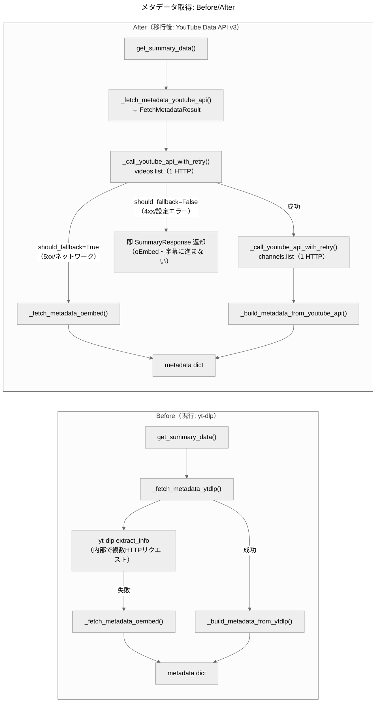
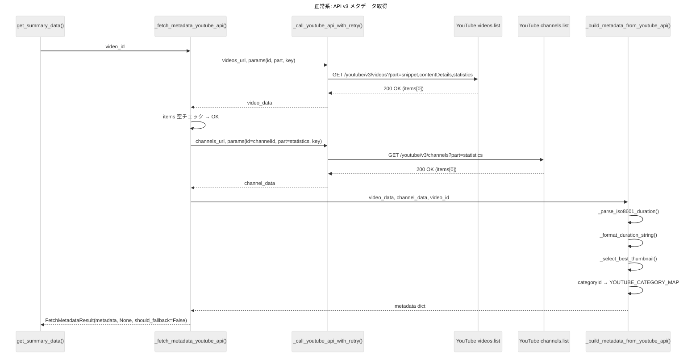
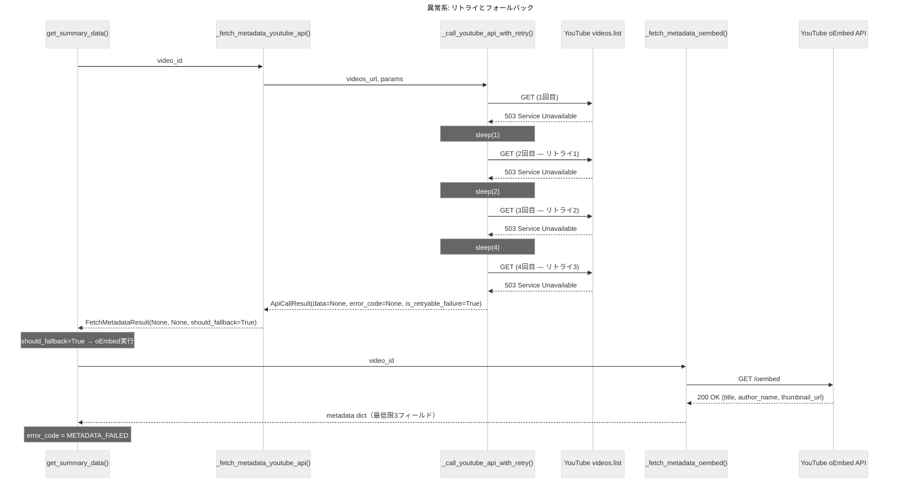
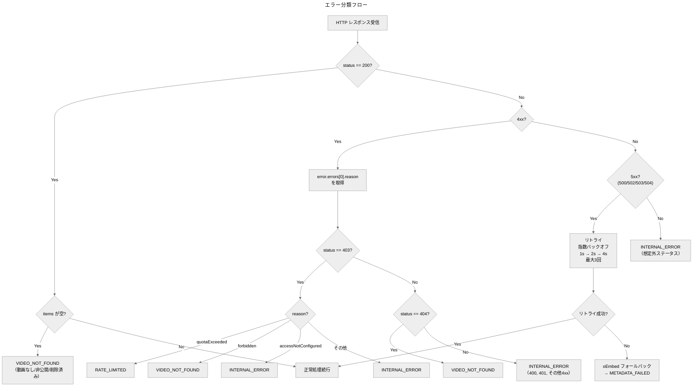

# 設計書: YouTube Data API v3 移行

## 1. 概要

本設計書は、YouTube Summary API のメタデータ取得手段を yt-dlp から YouTube Data API v3 に移行するための技術的な実装方針を定義する。

**設計方針:**
- サービス層（`app/services/youtube.py`）内部の変更のみで完結する
- `SummaryResponse` の全21プロパティ（名前・型・意味）は一切変更しない
- 新規依存は追加しない（`requests` は既存）
- 純粋関数を細かく分離し、テスタビリティを最大化する
- TDD サイクル（RED → GREEN → REFACTOR）で段階的に実装する

## 2. アーキテクチャ

### 図1: メタデータ取得フロー比較（Before/After）



### 図2: 正常系シーケンス — API v3 メタデータ取得



### 図3: 異常系シーケンス — リトライとフォールバック



## 3. モジュール変更設計

### 3.1 `app/services/youtube.py`

#### 削除する関数・import

| 対象 | 理由 |
|------|------|
| `import yt_dlp` | yt-dlp 依存の削除 |
| `from app.core.constants import YTDLP_DIRECT_KEYS, YTDLP_KEY_MAP` | 定数の削除に伴う |
| `_fetch_metadata_ytdlp()` | yt-dlp による取得を廃止 |
| `_build_metadata_from_ytdlp()` | yt-dlp レスポンスの変換を廃止 |
| `_convert_upload_date()` | YouTube API v3 は ISO 8601 datetime を返すため、別方式で変換 |

#### 新規追加する型・関数

**`FetchMetadataResult`（NamedTuple）:**

```python
from typing import NamedTuple

class FetchMetadataResult(NamedTuple):
    """メタデータ取得の結果を表す構造体。"""
    metadata: dict | None        # 成功時: metadata dict、失敗時: None
    error_code: str | None       # 成功時: None、失敗時: ERROR_* 定数
    should_fallback: bool        # True: oEmbed フォールバック可（5xx/ネットワークエラー）
                                 # False: フォールバック不可（4xx/設定エラー）
```

**`ApiCallResult`（NamedTuple）:**

```python
class ApiCallResult(NamedTuple):
    """単一API呼び出しの結果を表す構造体。"""
    data: dict | None            # 成功時: レスポンスJSON、失敗時: None
    error_code: str | None       # 成功時: None、失敗時: _classify_api_error() の結果
    is_retryable_failure: bool   # True: 5xx/ネットワークエラーで全リトライ失敗
```

| 関数名 | 責務 | 引数 | 戻り値 |
|--------|------|------|--------|
| `_fetch_metadata_youtube_api(video_id)` | videos.list + channels.list を呼び出し、metadata dict を構築 | `str` | `FetchMetadataResult` |
| `_call_youtube_api_with_retry(url, params)` | リトライ付き HTTP GET。エラー種別を含む結果を返す | `str, dict` | `ApiCallResult` |
| `_parse_iso8601_duration(duration_str)` | ISO 8601 duration → 秒数 | `str \| None` | `int \| None` |
| `_format_duration_string(total_seconds)` | 秒数 → `"H:MM:SS"` / `"M:SS"` | `int \| None` | `str \| None` |
| `_select_best_thumbnail(thumbnails)` | thumbnails dict から最適URL選択 | `dict \| None` | `str \| None` |
| `_build_metadata_from_youtube_api(video_data, channel_data, video_id)` | API レスポンス → metadata dict 構築 | `dict, dict \| None, str` | `dict` |
| `_classify_api_error(status_code, error_body)` | HTTPステータス+reason → error_code マッピング | `int, dict \| None` | `str` |
| `_resolve_error_message(error_code)` | error_code → message 変換。YouTube API 起因の `RATE_LIMITED` は `MSG_QUOTA_EXCEEDED` を返す | `str` | `str` |

#### 変更する関数

| 関数名 | 変更内容 |
|--------|---------|
| `get_summary_data()` | メタデータ取得を `_fetch_metadata_ytdlp()` → `_fetch_metadata_youtube_api()` に切り替え。戻り値 `FetchMetadataResult` に基づく3分岐: (1) `should_fallback=False` + `error_code` あり → **即時 `SummaryResponse` 返却**（oEmbed・字幕取得に進まない）、(2) `should_fallback=True` → oEmbed フォールバック + 字幕取得、(3) 成功 → 字幕取得。`_resolve_error_message()` ヘルパーで YouTube API 起因の `RATE_LIMITED` には `MSG_QUOTA_EXCEEDED` を使用 |

#### 変更しない関数

| 関数名 | 理由 |
|--------|------|
| `_extract_video_id()` | URL解析ロジックは変更不要 |
| `_fetch_metadata_oembed()` | フォールバック先として引き続き使用 |

### 3.2 `app/core/constants.py`

#### 追加する定数

```python
# --- YouTube Data API v3 ---
YOUTUBE_API_V3_VIDEOS_URL = "https://www.googleapis.com/youtube/v3/videos"
YOUTUBE_API_V3_CHANNELS_URL = "https://www.googleapis.com/youtube/v3/channels"
YOUTUBE_API_V3_TIMEOUT = (3.05, 10)  # (connect, read) seconds
YOUTUBE_API_V3_MAX_RETRIES = 3  # 最大リトライ回数（初回試行を除く。合計最大4回）
YOUTUBE_API_V3_RETRY_STATUS_CODES = {500, 502, 503, 504}

YOUTUBE_THUMBNAIL_PRIORITY = ["maxres", "standard", "high", "medium", "default"]

# YouTube カテゴリID → 英語名 静的マッピング（US基準）
YOUTUBE_CATEGORY_MAP = {
    "1": "Film & Animation",
    "2": "Autos & Vehicles",
    "10": "Music",
    "15": "Pets & Animals",
    "17": "Sports",
    "18": "Short Movies",
    "19": "Travel & Events",
    "20": "Gaming",
    "21": "Videoblogging",
    "22": "People & Blogs",
    "23": "Comedy",
    "24": "Entertainment",
    "25": "News & Politics",
    "26": "Howto & Style",
    "27": "Education",
    "28": "Science & Technology",
    "29": "Nonprofits & Activism",
    "30": "Movies",
    "31": "Anime/Animation",
    "32": "Action/Adventure",
    "33": "Classics",
    "34": "Comedy",
    "35": "Documentary",
    "36": "Drama",
    "37": "Family",
    "38": "Foreign",
    "39": "Horror",
    "40": "Sci-Fi/Fantasy",
    "41": "Thriller",
    "42": "Shorts",
    "43": "Shows",
    "44": "Trailers",
}

# --- クォータ超過メッセージ ---
MSG_QUOTA_EXCEEDED = "YouTube APIの日次クォータを超過しました。太平洋時間の午前0時（日本時間の午後5時頃）にリセットされます。"
```

#### 削除する定数

| 定数名 | 理由 |
|--------|------|
| `YTDLP_KEY_MAP` | yt-dlp 削除に伴い不要 |
| `YTDLP_DIRECT_KEYS` | yt-dlp 削除に伴い不要 |

#### `ERROR_CODE_TO_MESSAGE` の更新

`MSG_RATE_LIMITED` は変更しない（字幕API起因のレート制限で使用）。クォータ超過時は `MSG_QUOTA_EXCEEDED` をAPIレスポンスの `message` に返す:

```python
# 既存（変更なし）
MSG_RATE_LIMITED = "YouTubeへのリクエストが多すぎるため、一時的に情報を取得できません。時間をおいて再度お試しください。"

# 新規追加（APIレスポンスの message に使用）
MSG_QUOTA_EXCEEDED = "YouTube APIの日次クォータを超過しました。太平洋時間の午前0時（日本時間の午後5時頃）にリセットされます。"
```

**メッセージ出し分けルール:**

| 原因 | `error_code` | `message` |
|------|-------------|-----------|
| YouTube Data API v3 クォータ超過（403 quotaExceeded） | `RATE_LIMITED` | `MSG_QUOTA_EXCEEDED`（翌日再試行の判断に必要な情報を含む） |
| 字幕API レート制限（YouTubeRequestFailed / RequestBlocked） | `RATE_LIMITED` | `MSG_RATE_LIMITED`（既存動作を維持） |

> 設計根拠: 要件5-2「`message` にクォータ超過であることを示すメッセージを含める」を満たすため、`error_code` は同一（`RATE_LIMITED`）のまま `message` のみを原因別に出し分ける。これにより後方互換性を維持しつつ、ユーザーが「翌日再試行すればよい」と判断できる。

**実装方法:** `get_summary_data()` で `FetchMetadataResult.error_code` が `RATE_LIMITED` の場合、クォータ超過起因か否かを判定する。`_fetch_metadata_youtube_api()` がクォータ超過を検出した場合、`error_code=ERROR_RATE_LIMITED` を返すため、`get_summary_data()` 側でこれを受け取った時は `MSG_QUOTA_EXCEEDED` を使用する。字幕API起因の場合は従来通り `ERROR_CODE_TO_MESSAGE` マッピング経由で `MSG_RATE_LIMITED` が使われる。

> 区別方法: `_fetch_metadata_youtube_api()` 由来の `RATE_LIMITED` は `FetchMetadataResult.error_code` 経由で来るため、字幕例外由来の `RATE_LIMITED`（`transcript_error_code` 経由）と自然に区別できる。

### 3.3 `docker/Dockerfile.api`

```diff
 # FastAPI用Dockerfile
-# 要件: 4.2, 4.3, 4.4, 4.5

 FROM python:3.12-slim

-# Deno（yt-dlp 2025.11.12以降のYouTube完全サポートに必須）
-COPY --from=denoland/deno:bin /deno /usr/local/bin/deno
-
 # 作業ディレクトリを設定
 WORKDIR /app
```

### 3.4 `requirements.txt`

```diff
 fastapi==0.115.14
 uvicorn==0.35.0
 pydantic==2.9.2
 python-dotenv==1.1.1
 requests==2.32.4
-yt-dlp[default]
 youtube-transcript-api>=1.2.0
```

### 3.5 `.env.example`

以下を機密値セクションに追加:

```
# YouTube Data API v3 キー（Google Cloud Consoleから取得）
# https://console.cloud.google.com/apis/credentials
# .env.local に設定: YOUTUBE_API_KEY=AIzaSyXXXXXXXXXXXXXXXXXXXXXXXXXXXXXX
```

## 4. 新規関数の詳細設計

### 4.1 `_parse_iso8601_duration(duration_str: str | None) -> int | None`

ISO 8601 duration 文字列を秒数に変換する純粋関数。

**入出力仕様:**

| 入力 | 出力（秒） | 備考 |
|------|-----------|------|
| `"PT1H2M3S"` | `3723` | 標準パターン |
| `"PT30S"` | `30` | 秒のみ |
| `"PT10M"` | `600` | 分のみ |
| `"P0D"` | `0` | ライブ配信等 |
| `"PT0S"` | `0` | ゼロ秒 |
| `"P1DT2H3M4S"` | `93784` | 1日以上 |
| `None` | `None` | 入力なし |
| `""` | `None` | 空文字列 |

**実装方針:**
- 正規表現 `P(?:(\d+)D)?T?(?:(\d+)H)?(?:(\d+)M)?(?:(\d+)S)?` でパース
- マッチしない場合は `None` を返す

### 4.2 `_format_duration_string(total_seconds: int | None) -> str | None`

秒数を人間可読な時間文字列に変換する純粋関数。

**入出力仕様:**

| 入力（秒） | 出力 | 備考 |
|-----------|------|------|
| `3723` | `"1:02:03"` | 1時間以上 → `H:MM:SS` |
| `30` | `"0:30"` | 1時間未満 → `M:SS` |
| `600` | `"10:00"` | 分のみ |
| `0` | `"0:00"` | ゼロ |
| `93784` | `"26:03:04"` | 1日以上 |
| `None` | `None` | 入力なし |

**実装方針:**
- `hours = total_seconds // 3600`
- `hours >= 1` → `f"{hours}:{minutes:02d}:{seconds:02d}"`
- `hours == 0` → `f"{minutes}:{seconds:02d}"`

### 4.3 `_select_best_thumbnail(thumbnails: dict | None) -> str | None`

thumbnails dict から優先順位に従い最適な URL を選択する純粋関数。

**優先順位:** `maxres` → `standard` → `high` → `medium` → `default`

**入出力仕様:**

| 入力 | 出力 |
|------|------|
| `{"maxres": {"url": "..."}, "high": {"url": "..."}}` | maxres の URL |
| `{"high": {"url": "..."}, "medium": {"url": "..."}}` | high の URL |
| `{"default": {"url": "..."}}` | default の URL |
| `{}` | `None` |
| `None` | `None` |

**実装方針:**
- `YOUTUBE_THUMBNAIL_PRIORITY` を順に走査し、最初にヒットした URL を返す

### 4.4 `_call_youtube_api_with_retry(url: str, params: dict) -> ApiCallResult`

リトライ付きの HTTP GET。エラー種別を含む構造化された結果を返す。

**動作仕様:**
1. `requests.get(url, params=params, timeout=YOUTUBE_API_V3_TIMEOUT)` を実行
2. HTTP 200 → `ApiCallResult(data=json, error_code=None, is_retryable_failure=False)` を返す
3. HTTP 4xx → リトライせず `ApiCallResult(data=None, error_code=_classify_api_error(...), is_retryable_failure=False)` を返す
4. HTTP 500/502/503/504 → 指数バックオフ（1秒→2秒→4秒）でリトライ（`time.sleep` 使用）
5. 全リトライ失敗 → `ApiCallResult(data=None, error_code=None, is_retryable_failure=True)` を返す
6. ネットワークエラー（`requests.exceptions.RequestException`）→ リトライ対象。全リトライ失敗時は `is_retryable_failure=True`

**セキュリティ:**
- ログ出力時に URL をそのまま出力しない（APIキーを含むため）
- エラーログには `status_code` と `reason` のみを出力

### 4.5 `_build_metadata_from_youtube_api(video_data: dict, channel_data: dict | None, video_id: str) -> dict`

videos.list + channels.list のレスポンスから metadata dict を構築する。

**変換フロー（図4参照）:**

1. `snippet.title` → `title`
2. `snippet.channelTitle` → `channel_name`
3. `snippet.channelId` → `channel_id`
4. `snippet.publishedAt` → `upload_date`（ISO 8601 datetime → `YYYY-MM-DD` 切り出し）
5. `contentDetails.duration` → `duration`（`_parse_iso8601_duration()`）
6. `contentDetails.duration` → `duration_string`（`_format_duration_string()`）
7. `statistics.viewCount` → `view_count`（`int(str)`）
8. `statistics.likeCount` → `like_count`（`.get()` で `None` 許容 → `int(str)` if not None）
9. `snippet.thumbnails` → `thumbnail_url`（`_select_best_thumbnail()`）
10. `snippet.description` → `description`
11. `snippet.tags` → `tags`（`.get()` で `None` 許容）
12. `snippet.categoryId` → `categories`（`YOUTUBE_CATEGORY_MAP` で変換 → `[name]`）
13. `video_id` → `webpage_url`（`f"https://www.youtube.com/watch?v={video_id}"`）
14. `channel_data.statistics.subscriberCount` → `channel_follower_count`（`hiddenSubscriberCount` チェック付き）

### 4.6 `_fetch_metadata_youtube_api(video_id: str) -> FetchMetadataResult`

メタデータ取得のオーケストレーション関数。`FetchMetadataResult` を返し、呼び出し元がフォールバック可否を判断できる。

**処理フロー:**
1. `YOUTUBE_API_KEY` を `os.getenv()` で取得。未設定なら **即座に fail-fast**:
   - `FetchMetadataResult(metadata=None, error_code=ERROR_INTERNAL, should_fallback=False)` を返す
   - ログに `ERROR: YOUTUBE_API_KEY が設定されていません` を出力
   - **oEmbed フォールバックや字幕取得には進まない**（要件4-4: 設定不備を隠さない）
2. `_call_youtube_api_with_retry()` で `videos.list` を呼び出す → `ApiCallResult` を受け取る
3. `ApiCallResult` の判定:
   - `data` あり + `items` が空 → `FetchMetadataResult(None, ERROR_VIDEO_NOT_FOUND, should_fallback=False)`
   - `data` あり + `items` あり → 正常系（ステップ4へ）
   - `error_code` あり（4xx） → `FetchMetadataResult(None, error_code, should_fallback=False)`
   - `is_retryable_failure=True`（5xx/ネットワーク） → `FetchMetadataResult(None, None, should_fallback=True)`
4. `snippet.channelId` を取得し、`_call_youtube_api_with_retry()` で `channels.list` を呼び出す
5. `channels.list` 失敗 → `channel_data = None` として続行（部分成功）
6. `_build_metadata_from_youtube_api()` で metadata dict を構築
7. `FetchMetadataResult(metadata=metadata_dict, error_code=None, should_fallback=False)` を返す

**`get_summary_data()` での使用パターン:**

```python
result = _fetch_metadata_youtube_api(video_id)

if result.error_code and not result.should_fallback:
    # 4xx / 設定エラー → 即時レスポンス返却（oEmbed・字幕取得に進まない）
    # INTERNAL_ERROR（APIキー未設定）、RATE_LIMITED（quotaExceeded）、
    # VIDEO_NOT_FOUND（items空/forbidden/404）すべてここで短絡終了
    message = _resolve_error_message(result.error_code)
    return SummaryResponse(
        success=False,
        message=message,
        error_code=result.error_code,
    )
elif result.should_fallback:
    # 5xx / ネットワークエラー → oEmbed フォールバック + 字幕取得を試みる
    oembed_data = _fetch_metadata_oembed(video_id)
    metadata = oembed_data if oembed_data else {}
    api_failed = True
else:
    # 成功 → 字幕取得を試みる
    metadata = result.metadata
    api_failed = False

# --- 以下、字幕取得（should_fallback=True or 成功時のみ到達） ---
```

**重要: `should_fallback=False` かつ `error_code` ありの場合、字幕取得・oEmbed には一切進まない。** これにより:
- `RATE_LIMITED`（quotaExceeded）が字幕エラーで上書きされるリスクを排除
- `INTERNAL_ERROR`（APIキー未設定）が `METADATA_FAILED` に化けるリスクを排除
- 無駄な外部API呼び出し（youtube-transcript-api）を防止

**`_resolve_error_message()` ヘルパー:**

```python
def _resolve_error_message(error_code: str) -> str:
    """error_code に対応する message を返す。RATE_LIMITED はクォータ超過メッセージを使用。"""
    if error_code == ERROR_RATE_LIMITED:
        return MSG_QUOTA_EXCEEDED  # YouTube API 起因の RATE_LIMITED は常にクォータ超過
    return ERROR_CODE_TO_MESSAGE.get(error_code, MSG_INTERNAL_ERROR)
```

> 注: この関数は `_fetch_metadata_youtube_api()` 由来の `RATE_LIMITED` 専用。字幕API起因の `RATE_LIMITED` は従来通り `ERROR_CODE_TO_MESSAGE` 経由で `MSG_RATE_LIMITED` が返される。両者は制御フロー上で自然に分離される（前者は短絡終了、後者は字幕取得後の分岐で処理される）。

### 4.6.1 `get_summary_data()` の error_code / message 優先順位ルール

`get_summary_data()` の最終レスポンスにおける `error_code` と `message` の決定規則を以下に固定する。上位のルールが優先される。

| 優先度 | 条件 | `error_code` | `message` | `success` |
|--------|------|-------------|-----------|-----------|
| **1（最高）** | `FetchMetadataResult.error_code` あり + `should_fallback=False` | `result.error_code` | `_resolve_error_message(result.error_code)` | `False` |
| **2** | 字幕取得エラー（`transcript_error_code` あり） | `transcript_error_code` | `ERROR_CODE_TO_MESSAGE[transcript_error_code]` | `False` |
| **3** | フォールバック経由 + 字幕成功（`api_failed=True` + `transcript` あり） | `ERROR_METADATA_FAILED` | `MSG_METADATA_FAILED` | `True` |
| **4（最低）** | 全成功 | `None` | `MSG_SUCCESS` | `True` |

**制御フローの一貫性保証:**

- **優先度1は短絡終了**: `should_fallback=False` + `error_code` ありの場合、oEmbed・字幕取得に**一切進まず**即座に `SummaryResponse` を返す。したがって `transcript_error_code` は発生し得ない
- **優先度2〜4は排他的**: 字幕取得を試みるケース（メタデータ成功 or フォールバック経由）でのみ到達。字幕の成否で2/3/4のいずれかに分岐
- **`api_error_code` と `transcript_error_code` の同時存在は起こらない**: 優先度1で短絡するため、`api_error_code` が設定された状態で字幕取得には到達しない

**`RATE_LIMITED` の message 出し分けの保証:**

| 起因 | 到達パス | `message` | 回帰防止テスト |
|------|---------|-----------|---------------|
| YouTube Data API v3 quotaExceeded | 優先度1（短絡終了）→ `_resolve_error_message()` | `MSG_QUOTA_EXCEEDED` | Y-31 |
| 字幕API YouTubeRequestFailed/RequestBlocked | 優先度2（字幕取得後）→ `ERROR_CODE_TO_MESSAGE` | `MSG_RATE_LIMITED` | Y-6, Y-15 |

> **回帰防止の設計根拠:** `_resolve_error_message()` は `RATE_LIMITED` → `MSG_QUOTA_EXCEEDED` を返す関数であり、YouTube Data API の quotaExceeded 経路（優先度1・短絡終了）専用である。将来のリファクタリングでこの関数が字幕エラー経路にも誤適用されると、`MSG_RATE_LIMITED` であるべき箇所に `MSG_QUOTA_EXCEEDED` が返る回帰が発生する。Y-6 と Y-15 に `message == MSG_RATE_LIMITED` の明示アサートを追加することで、この回帰を自動テストで検出可能にする。

### 4.7 `_classify_api_error(status_code: int, error_body: dict | None) -> str`

HTTPステータスコードとエラーレスポンスボディから error_code を判定する（図5参照）。

**マッピングテーブル:**

| HTTP | reason | 戻り値 |
|------|--------|--------|
| 400 | `badRequest` | `ERROR_INTERNAL` |
| 401 | `unauthorized` | `ERROR_INTERNAL` |
| 403 | `quotaExceeded` | `ERROR_RATE_LIMITED` |
| 403 | `forbidden` | `ERROR_VIDEO_NOT_FOUND` |
| 403 | `accessNotConfigured` | `ERROR_INTERNAL` |
| 404 | `notFound` | `ERROR_VIDEO_NOT_FOUND` |
| 403 | その他 | `ERROR_INTERNAL` |
| その他 4xx | — | `ERROR_INTERNAL` |

## 5. フィールド変換パイプライン

### 図4: フィールド変換パイプライン

```mermaid
---
title: "フィールド変換パイプライン"
config:
  theme: neutral
---
flowchart TD
    API["videos.list レスポンス\n(items[0])"] --> SNP["snippet"]
    API --> CD["contentDetails"]
    API --> ST["statistics"]
    CH["channels.list レスポンス\n(items[0])"] --> CHS["statistics"]

    SNP --> T1["snippet.title → title\n（そのまま）"]
    SNP --> T2["snippet.channelTitle → channel_name\n（そのまま）"]
    SNP --> T3["snippet.channelId → channel_id\n（そのまま）"]
    SNP --> T4["snippet.publishedAt → upload_date\n（ISO 8601 → YYYY-MM-DD 切り出し）"]
    SNP --> T9["snippet.thumbnails → thumbnail_url\n（_select_best_thumbnail）"]
    SNP --> T10["snippet.description → description\n（そのまま）"]
    SNP --> T11["snippet.tags → tags\n（.get で None 許容）"]
    SNP --> T12["snippet.categoryId → categories\n（YOUTUBE_CATEGORY_MAP → [name]）"]

    CD --> T5["contentDetails.duration\n→ _parse_iso8601_duration()\n→ duration (int)"]
    CD --> T6["contentDetails.duration\n→ _parse_iso8601_duration()\n→ _format_duration_string()\n→ duration_string (str)"]

    ST --> T7["statistics.viewCount → view_count\n（int(str)）"]
    ST --> T8["statistics.likeCount → like_count\n（.get → int(str) or None）"]

    CHS --> T14["statistics.subscriberCount\n→ channel_follower_count\n（hiddenSubscriberCount チェック\n→ int(str) or None）"]

    VID["video_id"] --> T13["webpage_url\nhttps://www.youtube.com/watch?v={video_id}"]
```



## 6. エラーハンドリングフロー

### 図5: エラー分類フロー



## 7. TDD テストケース設計

### 7.1 テスト番号体系

既存の Y-1〜Y-17, S-1〜S-6, E-1〜E-7 を踏襲。既存テストは v3 API 用に書き換え、新規テストは Y-18 以降に追加。

### 7.2 新規テスト — 純粋関数（parametrize で網羅）

#### `test_parse_iso8601_duration`（Y-18）

```python
@pytest.mark.parametrize("input_str,expected", [
    ("PT1H2M3S", 3723),
    ("PT30S", 30),
    ("PT10M", 600),
    ("P0D", 0),
    ("PT0S", 0),
    ("P1DT2H3M4S", 93784),
    (None, None),
    ("", None),
])
def test_y18_parse_iso8601_duration(input_str, expected):
    assert _parse_iso8601_duration(input_str) == expected
```

#### `test_format_duration_string`（Y-19）

```python
@pytest.mark.parametrize("seconds,expected", [
    (3723, "1:02:03"),
    (30, "0:30"),
    (600, "10:00"),
    (0, "0:00"),
    (93784, "26:03:04"),
    (None, None),
])
def test_y19_format_duration_string(seconds, expected):
    assert _format_duration_string(seconds) == expected
```

#### `test_select_best_thumbnail`（Y-20）

```python
@pytest.mark.parametrize("thumbnails,expected_key", [
    # 全キーあり → maxres
    ({"maxres": {"url": "maxres_url"}, "standard": {"url": "std_url"}, "high": {"url": "high_url"}, "medium": {"url": "med_url"}, "default": {"url": "def_url"}}, "maxres_url"),
    # maxres欠損 → standard
    ({"standard": {"url": "std_url"}, "high": {"url": "high_url"}, "medium": {"url": "med_url"}, "default": {"url": "def_url"}}, "std_url"),
    # standard欠損 → high
    ({"high": {"url": "high_url"}, "medium": {"url": "med_url"}, "default": {"url": "def_url"}}, "high_url"),
    # high以下のみ
    ({"medium": {"url": "med_url"}, "default": {"url": "def_url"}}, "med_url"),
    # 空dict
    ({}, None),
    # None
    (None, None),
])
def test_y20_select_best_thumbnail(thumbnails, expected_key):
    assert _select_best_thumbnail(thumbnails) == expected_key
```

#### `test_category_id_to_name`（Y-21）

`_build_metadata_from_youtube_api` 内のカテゴリ変換ロジックを検証:

```python
@pytest.mark.parametrize("category_id,expected", [
    ("27", ["Education"]),
    ("10", ["Music"]),
    ("999", ["999"]),      # 未知ID → そのまま文字列
    (None, None),
])
def test_y21_category_conversion(category_id, expected):
    # _build_metadata_from_youtube_api 経由で検証
    ...
```

#### `test_classify_api_error`（Y-22）

```python
@pytest.mark.parametrize("status_code,reason,expected_error_code", [
    (400, "badRequest", ERROR_INTERNAL),
    (401, "unauthorized", ERROR_INTERNAL),
    (403, "quotaExceeded", ERROR_RATE_LIMITED),
    (403, "forbidden", ERROR_VIDEO_NOT_FOUND),
    (403, "accessNotConfigured", ERROR_INTERNAL),
    (403, "otherReason", ERROR_INTERNAL),
    (404, "notFound", ERROR_VIDEO_NOT_FOUND),
    (429, None, ERROR_INTERNAL),          # 想定外 4xx
    (418, None, ERROR_INTERNAL),          # 想定外 4xx
])
def test_y22_classify_api_error(status_code, reason, expected_error_code):
    error_body = {"error": {"errors": [{"reason": reason}]}} if reason else None
    assert _classify_api_error(status_code, error_body) == expected_error_code
```

### 7.3 新規テスト — API呼び出し層

#### `test_call_youtube_api_with_retry` — リトライロジック（Y-23〜Y-25）

**重要: `time.sleep` のモック** — 全リトライテストで `@patch("app.services.youtube.time.sleep")` を使用し、実際の待機を発生させない。

| # | テストケース | モック状態 | 期待結果 |
|---|------------|-----------|---------|
| Y-23 | サーバーエラー→リトライ→成功 | 1回目 503, 2回目 200, sleep モック | `ApiCallResult(data=json, error_code=None, is_retryable_failure=False)`, sleep が1回呼ばれ引数は `1` |
| Y-24 | 全リトライ失敗 + sleep 回数・秒数検証 | 4回とも 503, sleep モック | `ApiCallResult(data=None, error_code=None, is_retryable_failure=True)`, sleep が3回呼ばれ引数は順に `1, 2, 4` |
| Y-25 | 4xx はリトライしない | 403 quotaExceeded | `ApiCallResult(data=None, error_code=ERROR_RATE_LIMITED, is_retryable_failure=False)`, requests.get が1回だけ呼ばれる, sleep は呼ばれない |

```python
# Y-24 のテストコード例
@patch("app.services.youtube.time.sleep")
@patch("app.services.youtube.requests.get")
def test_y24_all_retries_exhausted(mock_get, mock_sleep):
    # 4回とも 503 を返す
    mock_resp = MagicMock(status_code=503)
    mock_resp.json.return_value = {}
    mock_get.return_value = mock_resp

    result = _call_youtube_api_with_retry(url, params)

    assert result.data is None
    assert result.is_retryable_failure is True
    assert mock_get.call_count == 4  # 初回 + 3回リトライ
    assert mock_sleep.call_args_list == [call(1), call(2), call(4)]
```

#### `test_fetch_metadata_youtube_api`（Y-26〜Y-29）

| # | テストケース | モック状態 | 期待結果 |
|---|------------|-----------|---------|
| Y-26 | 正常系: videos.list + channels.list 成功 | 両方 200 | `FetchMetadataResult(metadata=dict, error_code=None, should_fallback=False)` |
| Y-27 | 動画なし（items 空） | videos.list 200 但し items=[] | `FetchMetadataResult(None, ERROR_VIDEO_NOT_FOUND, should_fallback=False)` |
| Y-28 | クォータ超過 | videos.list 403 quotaExceeded | `FetchMetadataResult(None, ERROR_RATE_LIMITED, should_fallback=False)` |
| Y-29 | channels.list 失敗時の部分成功 | videos.list 200, channels.list 失敗 | `FetchMetadataResult(metadata=dict, error_code=None, should_fallback=False)` で `channel_follower_count=None` |

#### 受入基準直結テスト（Y-30〜Y-32）

| # | テストケース | 対応要件 | モック状態 | 期待結果 |
|---|------------|---------|-----------|---------|
| Y-30 | YOUTUBE_API_KEY 未設定→即INTERNAL_ERROR（単体） | US-4 受入基準4 | `monkeypatch.delenv("YOUTUBE_API_KEY")` | `FetchMetadataResult(None, ERROR_INTERNAL, should_fallback=False)` |
| Y-30b | YOUTUBE_API_KEY 未設定→短絡終了（統合） | US-4 受入基準4 | `monkeypatch.delenv` + `mock_ytt` + `mock_get` | `success=False, error_code=INTERNAL_ERROR` + **字幕API/oEmbed 未呼び出し** |
| Y-31 | クォータ超過→RATE_LIMITED+MSG_QUOTA_EXCEEDED+短絡終了 | US-5 受入基準1,2 | videos.list 403 quotaExceeded + `mock_ytt` | `success=False, error_code=RATE_LIMITED, message=MSG_QUOTA_EXCEEDED` + **字幕API 未呼び出し** + requests.get 1回のみ |
| Y-32 | 5xxリトライ枯渇→oEmbedフォールバック+字幕取得 | US-6 受入基準1,2 | videos.list 4回とも 503（sleepモック）, oEmbed成功, 字幕成功 | `success=True, error_code=METADATA_FAILED` + sleep(1,2,4) + oEmbed 実行 |

```python
# Y-30 のテストコード例（_fetch_metadata_youtube_api 単体テスト）
def test_y30_api_key_not_set(monkeypatch):
    """YOUTUBE_API_KEY 未設定 → 即座に INTERNAL_ERROR、フォールバック不可"""
    monkeypatch.delenv("YOUTUBE_API_KEY", raising=False)

    result = _fetch_metadata_youtube_api("dQw4w9WgXcQ")

    assert result.metadata is None
    assert result.error_code == ERROR_INTERNAL
    assert result.should_fallback is False

# Y-30b のテストコード例（get_summary_data 統合テスト — 字幕未呼び出し検証）
@patch("app.services.youtube.requests.get")
@patch("app.services.youtube.YouTubeTranscriptApi")
def test_y30b_api_key_not_set_no_transcript_call(mock_ytt_class, mock_get, monkeypatch):
    """YOUTUBE_API_KEY 未設定 → 即時 INTERNAL_ERROR 返却、字幕API・oEmbed 呼び出しなし"""
    monkeypatch.delenv("YOUTUBE_API_KEY", raising=False)

    result = get_summary_data(VALID_URL)

    assert result.success is False
    assert result.error_code == ERROR_INTERNAL
    # 字幕API が呼ばれていないことを検証
    mock_ytt_class.return_value.fetch.assert_not_called()
    # oEmbed / YouTube API が呼ばれていないことを検証
    mock_get.assert_not_called()

# Y-31 のテストコード例（字幕未呼び出し検証付き）
@patch("app.services.youtube.requests.get")
@patch("app.services.youtube.YouTubeTranscriptApi")
def test_y31_quota_exceeded_message(mock_ytt_class, mock_get):
    """クォータ超過 → 即時 RATE_LIMITED + MSG_QUOTA_EXCEEDED、字幕API 呼び出しなし"""
    mock_resp = MagicMock(status_code=403)
    mock_resp.json.return_value = {
        "error": {"errors": [{"reason": "quotaExceeded"}]}
    }
    mock_get.return_value = mock_resp

    result = get_summary_data(VALID_URL)

    assert result.success is False
    assert result.error_code == ERROR_RATE_LIMITED
    assert result.message == MSG_QUOTA_EXCEEDED  # ← quotaExceeded 経路のみ MSG_QUOTA_EXCEEDED
    # 字幕API が呼ばれていないことを検証（短絡終了の保証）
    mock_ytt_class.return_value.fetch.assert_not_called()
    # requests.get は YouTube API v3 呼び出しの1回のみ（oEmbed なし）
    assert mock_get.call_count == 1

# Y-6 更新後のテストコード例（字幕API起因 RATE_LIMITED の message 回帰防止）
# ※ メタデータ mock は v3 形式に書き換え後
def test_y6_rate_limited(mock_requests_get, mock_ytt_class, youtube_api_v3_video_response, ...):
    """YouTubeRequestFailed → error_code=RATE_LIMITED, message=MSG_RATE_LIMITED（MSG_QUOTA_EXCEEDED ではない）"""
    # ... (メタデータ v3 mock 省略)

    result = get_summary_data(VALID_URL)

    assert result.success is False
    assert result.error_code == ERROR_RATE_LIMITED
    assert result.message == MSG_RATE_LIMITED  # ← 字幕API起因は MSG_RATE_LIMITED を保証

# Y-15 更新後のテストコード例（同上）
def test_y15_request_blocked(mock_requests_get, mock_ytt_class, youtube_api_v3_video_response, ...):
    """RequestBlocked → error_code=RATE_LIMITED, message=MSG_RATE_LIMITED（MSG_QUOTA_EXCEEDED ではない）"""
    # ... (メタデータ v3 mock 省略)

    result = get_summary_data(VALID_URL)

    assert result.success is False
    assert result.error_code == ERROR_RATE_LIMITED
    assert result.message == MSG_RATE_LIMITED  # ← 字幕API起因は MSG_RATE_LIMITED を保証
```

### 7.4 既存テスト Y-1〜Y-17 の更新方針

#### import の追加

```python
# test_youtube_service.py の import に追加
from app.core.constants import (
    ...,
    MSG_RATE_LIMITED,       # Y-6, Y-15 の message 回帰防止アサートで使用
    MSG_QUOTA_EXCEEDED,     # Y-31 の message アサートで使用
)
```

#### モック対象の全面書き換え

| Before | After |
|--------|-------|
| `@patch("app.services.youtube.yt_dlp.YoutubeDL")` | `@patch("app.services.youtube.requests.get")` |
| `mock_ydl.extract_info.return_value = ytdlp_success_info` | `mock_requests_get.side_effect = [videos_response, channels_response]` |

#### 主要テストの更新内容

| # | 変更概要 |
|---|---------|
| Y-1 | yt-dlp mock → requests.get mock（videos.list + channels.list）。全フィールドの期待値を v3 形式に更新 |
| Y-2 | yt-dlp 失敗 → YouTube API v3 失敗（リトライ後も失敗）→ oEmbed フォールバック |
| Y-3 | メタデータ成功の mock を v3 形式に変更。字幕エラーの検証は変更なし |
| Y-4 | yt-dlp DownloadError → videos.list が items=[] を返す形式に変更 |
| Y-6 | yt-dlp mock 削除。メタデータは v3 形式で成功させ、字幕エラーのみ検証。**`message == MSG_RATE_LIMITED` を明示アサート追加**（字幕API起因の RATE_LIMITED が MSG_QUOTA_EXCEEDED に回帰しないことを保証） |
| Y-7 | 同上 |
| Y-8 | `like_count` 欠損 → likeCount フィールドが statistics に存在しない v3 レスポンス |
| Y-10 | yt-dlp 失敗 → v3 API 失敗 + oEmbed フォールバック成功 + 字幕成功 |
| Y-12 | yt-dlp 最小キー → v3 レスポンスの一部フィールドが欠損するケース |
| Y-14, Y-15 | メタデータ成功の mock を v3 形式に変更。**Y-15: `message == MSG_RATE_LIMITED` を明示アサート追加**（Y-6 と同様、字幕API起因の回帰防止） |
| Y-16 | yt-dlp 失敗 → v3 API 失敗 → oEmbed タイムアウト |
| Y-5, Y-11, Y-13, Y-17 | 変更なし（URL検証、transcript形式、定数確認、video_id抽出は移行の影響を受けない） |

### 7.5 `conftest.py` のフィクスチャ更新

#### 削除

- `ytdlp_success_info` — yt-dlp 形式のフィクスチャ

#### 新規追加

```python
@pytest.fixture
def youtube_api_v3_video_response():
    """YouTube Data API v3 videos.list の成功レスポンス"""
    return {
        "items": [{
            "snippet": {
                "title": "テスト動画タイトル",
                "channelTitle": "テストチャンネル",
                "channelId": "UCxxxxxxxxxxxxxxxxxxxx",
                "publishedAt": "2026-02-08T10:00:00Z",
                "description": "これはテスト動画の概要欄です。",
                "thumbnails": {
                    "default": {"url": "https://i.ytimg.com/vi/dQw4w9WgXcQ/default.jpg"},
                    "medium": {"url": "https://i.ytimg.com/vi/dQw4w9WgXcQ/mqdefault.jpg"},
                    "high": {"url": "https://i.ytimg.com/vi/dQw4w9WgXcQ/hqdefault.jpg"},
                    "standard": {"url": "https://i.ytimg.com/vi/dQw4w9WgXcQ/sddefault.jpg"},
                    "maxres": {"url": "https://i.ytimg.com/vi/dQw4w9WgXcQ/maxresdefault.jpg"},
                },
                "tags": ["Python", "Tutorial"],
                "categoryId": "27",
            },
            "contentDetails": {
                "duration": "PT6M",
            },
            "statistics": {
                "viewCount": "54000",
                "likeCount": "1200",
            },
        }],
    }


@pytest.fixture
def youtube_api_v3_channel_response():
    """YouTube Data API v3 channels.list の成功レスポンス"""
    return {
        "items": [{
            "statistics": {
                "subscriberCount": "1250000",
                "hiddenSubscriberCount": False,
            },
        }],
    }


@pytest.fixture
def youtube_api_v3_empty_response():
    """YouTube Data API v3 の空レスポンス（動画なし/非公開/削除済み）"""
    return {"items": []}


@pytest.fixture
def youtube_api_v3_quota_error():
    """YouTube Data API v3 のクォータ超過エラーレスポンス"""
    return {
        "error": {
            "code": 403,
            "message": "The request cannot be completed because you have exceeded your quota.",
            "errors": [{
                "message": "The request cannot be completed because you have exceeded your quota.",
                "domain": "youtube.quota",
                "reason": "quotaExceeded",
            }],
        },
    }
```

### 7.6 モック戦略の変更

| Before | After |
|--------|-------|
| `@patch("app.services.youtube.yt_dlp.YoutubeDL")` | 削除 |
| `@patch("app.services.youtube.requests.get")` — oEmbed 用 | `@patch("app.services.youtube.requests.get")` — v3 API + oEmbed 兼用 |

`requests.get` の mock は `side_effect` リストで呼び出し順に応答を制御:

```python
# 例: videos.list 成功 → channels.list 成功
mock_requests_get.side_effect = [
    mock_videos_response,    # 1回目: videos.list
    mock_channels_response,  # 2回目: channels.list
]
```

### 7.7 環境変数のモック

`YOUTUBE_API_KEY` のモック:

```python
@pytest.fixture(autouse=True)
def mock_youtube_api_key(monkeypatch):
    """全テストで YOUTUBE_API_KEY を設定（Y-30 では delenv で上書き）"""
    monkeypatch.setenv("YOUTUBE_API_KEY", "test-youtube-api-key")
```

### 7.8 `time.sleep` のモック方針

リトライロジックの `time.sleep` はテスト時に実時間待ちを発生させないようモックする:

- **対象テスト:** Y-23, Y-24, Y-25, Y-32 などリトライが発生するテスト
- **モック方法:** `@patch("app.services.youtube.time.sleep")` でパッチ
- **検証項目:** `mock_sleep.call_args_list` で呼び出し回数と引数（1, 2, 4 秒）を検証
- **理由:** 実時間待ち（最大7秒/テスト）はCI安定性を損ない、テストスイート全体の実行時間を不必要に増加させる

## 8. 実装フェーズ（TDD サイクル）

### Phase 1: 定数追加 + テスト基盤更新

**変更ファイル:** `app/core/constants.py`, `tests/conftest.py`

1. `constants.py` に YouTube Data API v3 関連の定数を追加
2. `YTDLP_KEY_MAP`, `YTDLP_DIRECT_KEYS` はこの時点では残す（既存テストが依存）
3. `conftest.py` に v3 レスポンスフィクスチャを追加
4. `YOUTUBE_API_KEY` の `autouse` フィクスチャを追加
5. 既存テストが引き続き PASS することを確認

### Phase 2: 純粋関数の TDD

**変更ファイル:** `app/services/youtube.py`, `tests/test_youtube_service.py`

1. **RED**: Y-18（duration パーサ）、Y-19（duration 文字列）、Y-20（サムネイル選択）のテストを追加 → FAIL
2. **GREEN**: `_parse_iso8601_duration()`, `_format_duration_string()`, `_select_best_thumbnail()` を実装 → PASS
3. **REFACTOR**: 必要に応じてリファクタリング

### Phase 3: API 呼び出し層の TDD

**変更ファイル:** `app/services/youtube.py`, `tests/test_youtube_service.py`

1. **RED**: Y-22（エラー分類）、Y-23〜Y-25（リトライ、`time.sleep` モック付き）のテストを追加 → FAIL
2. **GREEN**: `ApiCallResult`, `_classify_api_error()`, `_call_youtube_api_with_retry()` を実装 → PASS
3. **REFACTOR**: 必要に応じてリファクタリング

### Phase 4: メタデータ構築の TDD

**変更ファイル:** `app/services/youtube.py`, `tests/test_youtube_service.py`

1. **RED**: Y-21（カテゴリ変換）、Y-26〜Y-30, Y-30b, Y-31, Y-32（FetchMetadataResult 検証、APIキー未設定、クォータ超過メッセージ、フォールバック可否）のテストを追加 → FAIL
2. **GREEN**: `FetchMetadataResult`, `_build_metadata_from_youtube_api()`, `_fetch_metadata_youtube_api()` を実装 → PASS
3. **REFACTOR**: 必要に応じてリファクタリング

### Phase 5: 統合 — get_summary_data のメインフロー書き換え + 既存テスト更新

**変更ファイル:** `app/services/youtube.py`, `tests/test_youtube_service.py`, `tests/conftest.py`

1. `get_summary_data()` のメタデータ取得を `_fetch_metadata_youtube_api()` に切り替え
2. Y-1〜Y-17 のテストを v3 API モック形式に全面書き換え
3. `conftest.py` から `ytdlp_success_info` を削除
4. 全テスト PASS を確認

### Phase 6: yt-dlp 削除 + Docker/依存関係更新

**変更ファイル:** `app/services/youtube.py`, `app/core/constants.py`, `requirements.txt`, `docker/Dockerfile.api`, `.env.example`

1. `youtube.py` から `import yt_dlp`, `_fetch_metadata_ytdlp()`, `_build_metadata_from_ytdlp()`, `_convert_upload_date()` を削除
2. `constants.py` から `YTDLP_KEY_MAP`, `YTDLP_DIRECT_KEYS` を削除
3. `requirements.txt` から `yt-dlp[default]` を削除
4. `Dockerfile.api` から Deno インストール行を削除
5. `.env.example` に `YOUTUBE_API_KEY` のプレースホルダーを追加
6. 全テスト PASS を確認
7. `docker compose build api` でビルド成功を確認

## 9. 設計上の決定事項

### 決定1: 関数分割の粒度

**方針:** 純粋関数（パーサ、フォーマッタ、セレクタ）を独立させ、副作用を持つ関数（HTTP呼び出し）と分離する。

**理由:**
- 純粋関数は `parametrize` で境界値を網羅的にテストできる
- HTTP呼び出し関数のテストは `requests.get` の mock だけで済む
- `_build_metadata_from_youtube_api()` は純粋関数として入力→出力のマッピングをテストできる

### 決定2: `FetchMetadataResult` NamedTuple による構造化戻り値

**方針:** `FetchMetadataResult(metadata, error_code, should_fallback)` の NamedTuple を返す。`_call_youtube_api_with_retry()` も同様に `ApiCallResult(data, error_code, is_retryable_failure)` を返す。

**理由:**
- `get_summary_data()` がエラー種別（`VIDEO_NOT_FOUND`, `RATE_LIMITED` 等）とフォールバック可否の両方を判断するために、3つの情報が必要
- 素の tuple ではフィールドの意味が不明確になるため、NamedTuple で名前付きアクセスを提供
- `should_fallback=True` は「5xx/ネットワークエラーでリトライ枯渇時のみ」に限定し、4xx（quotaExceeded, forbidden 等）や設定エラーではフォールバックを禁止
- 例外ベースの設計も検討したが、`get_summary_data()` 側の `try/except` が複雑化するため採用しない

**排除した代替案:**
- **`dict | None` のみ**: error_code とフォールバック可否の情報が欠落し、要件5（クォータ超過）と要件6（フォールバック条件）を同時に満たせない
- **例外多用**: `get_summary_data()` の分岐が複雑化し、MVP で過剰

### 決定3: `requests.get` の mock 戦略

**方針:** `side_effect` リストで呼び出し順に応答を制御する。

**理由:**
- `_call_youtube_api_with_retry()` と `_fetch_metadata_oembed()` の両方が `requests.get` を使用する
- `side_effect` リストにより、videos.list → channels.list → oEmbed の順に異なるレスポンスを返せる
- URL を条件分岐する方式も検討したが、`side_effect` リストの方がテストコードが簡潔

### 決定4: クォータ超過メッセージの原因別出し分け

**方針:** `error_code` は `RATE_LIMITED` で統一するが、`message` は原因別に出し分ける。

**理由:**
- 要件5-2「`message` にクォータ超過であることを示すメッセージを含める」に準拠
- クォータ超過時は `MSG_QUOTA_EXCEEDED`（翌日再試行の判断情報を含む）をレスポンス `message` に返す
- 字幕API起因のレート制限は `MSG_RATE_LIMITED`（既存動作維持）
- `error_code` の新設は後方互換性リスクが高いため、同一コード + メッセージ出し分けで対応

**排除した代替案:**
- **汎用 `MSG_RATE_LIMITED` で統一**: ユーザーが「翌日再試行すればよい」と判断するための情報が欠落し、要件5-2に抵触
- **新 `error_code` の追加（`QUOTA_EXCEEDED`）**: iPhoneショートカット側の修正が必要になり後方互換性が崩れる

## 10. 検証方法

### 10.1 自動テスト（pytest）

```bash
# 全テスト実行
pytest tests/ -v

# サービス層のみ
pytest tests/test_youtube_service.py -v

# 新規テストのみ
pytest tests/test_youtube_service.py -k "y18 or y19 or y20 or y21 or y22 or y23 or y24 or y25 or y26 or y27 or y28 or y29 or y30 or y31 or y32" -v

# 短絡終了の保証テスト（字幕未呼び出し検証）
pytest tests/test_youtube_service.py -k "y30b or y31" -v
```

### 10.2 Docker ビルド確認

```bash
# APIコンテナのビルド（yt-dlp, Deno が不要になったことを確認）
docker compose build api

# コンテナ起動
docker compose up -d

# ヘルスチェック
curl http://localhost:10000/
```

### 10.3 手動統合テスト

```bash
# 実際の YouTube 動画でメタデータ取得（YOUTUBE_API_KEY が .env.local に設定済みであること）
curl -X POST http://localhost:10000/api/v1/summary \
  -H "Content-Type: application/json" \
  -H "X-API-KEY: ${API_KEY}" \
  -d '{"url": "https://www.youtube.com/watch?v=dQw4w9WgXcQ"}'

# 確認項目:
# - 全14メタデータフィールドに値が入っていること
# - upload_date が YYYY-MM-DD 形式であること
# - duration が秒数（int）であること
# - duration_string が "M:SS" or "H:MM:SS" 形式であること
# - categories がカテゴリ名のリストであること（例: ["Music"]）
# - channel_follower_count が int であること
# - thumbnail_url が最高解像度のURLであること

# 存在しない動画
curl -X POST http://localhost:10000/api/v1/summary \
  -H "Content-Type: application/json" \
  -H "X-API-KEY: ${API_KEY}" \
  -d '{"url": "https://www.youtube.com/watch?v=xxxxxxxxxxx"}'

# 確認項目:
# - error_code が "VIDEO_NOT_FOUND" であること
```

## 参照ドキュメント

- 要件定義書: `.kiro/specs/youtube-api-v3-migration/requirements.md`
- 既存設計書（Docker/Tailscale）: `.kiro/specs/tailnet-docker-foundation/design.md`
- 既存設計書（TDD）: `.kiro/specs/api-enhancements/design.md`
- YouTube Data API v3 公式ドキュメント: https://developers.google.com/youtube/v3/docs/videos/list
- 専門家調査結果: `docs/expert-reviews/youtube-data-api-v3-technical-constraints.md`
