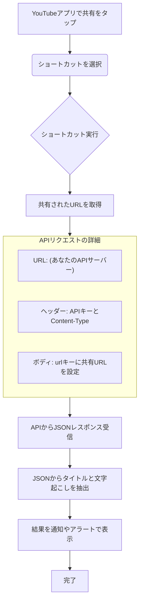

# [[iPhone]]ショートカットからYouTube要約APIを利用する方法

このドキュメントは、作成した `youtube-summary-api` を [[iPhone]] の「ショートカット」アプリから呼び出し、YouTubeアプリの「共有」メニューからワンタップで動画の情報を取得する手順を解説します。

## 準備するもの

- **APIの公開URL**: `https://youtube-summary-api-410.onrender.com`
- **あなたのAPIキー**: [[Render]]で設定した、あなた専用のAPIキー

## ショートカット作成手順

### フローチャート

### 詳細な設定手順

1.  **ショートカットアプリを開く**
    -   [[iPhone]]の「ショートカット」アプリを起動し、右上の `+` ボタンをタップして新規ショートカットを作成します。

2.  **共有シートからの入力を設定**
    -   画面上部のショートカット名（例: `新規ショートカット 1`）をタップし、`詳細` を選択します。
    -   **`共有シートに表示`** をオンにします。これで、他のアプリの共有メニューからこのショートカットを呼び出せるようになります。
    -   `共有シートの入力` の設定が表示されるので、`クリア` をタップし、**`URL`** のみを選択します。
    -   完了をタップして設定を閉じます。

3.  **アクションを追加: 「URLの内容を取得」**
    -   `+ アクションを追加` をタップし、「**URLの内容を取得**」アクションを検索して追加します。
    -   アクション内の青い文字 `URL` をタップし、`ショートカットの入力` 変数を選択します。
    -   アクションの右向き矢印 `>` をタップして詳細設定を開きます。
        -   **方法**: `POST` を選択します。
        -   **ヘッダ**: `+ 新規ヘッダを追加` を2回タップし、以下のように設定します。
            -   1つ目: `キー` に `X-API-KEY`、`テキスト` に **あなたのAPIキー** を入力します。
            -   2つ目: `キー` に `Content-Type`、`テキスト` に `application/json` を入力します。
        -   **要求本文**: `JSON` を選択し、`+ 新規フィールドを追加` をタップします。
            -   `キー` に `url`、`テキスト` に `ショートカットの入力` 変数を選択します。

4.  **アクションを追加: 「辞書の値を取得」**
    -   `+ アクションを追加` をタップし、「**辞書の値を取得**」アクションを追加します。
    -   `辞書` には、直前のアクション（URLの内容）を示す `URLの内容` 変数を選択します。
    -   `キー` に `transcript` と入力します。（これで文字起こしが取得できます）

5.  **アクションを追加: 「結果を表示」**
    -   `+ アクションを追加` をタップし、「**結果を表示**」アクションを追加します。
    -   表示されるテキストの初期値（`辞書の値`）をタップし、その中身を `クリップボードにコピー` してから、再度 `結果を表示` アクションを追加し、クリップボードの内容を貼り付けます。
    -   `辞書の値` 変数の前に `文字起こし結果：` などのテキストを追加すると、より分かりやすくなります。

6.  **保存**
    -   画面上部のショートカット名を「YouTube要約」などの分かりやすい名前に変更し、`完了` をタップして保存します。

## 使い方

1.  YouTubeアプリで、情報を取得したい動画を開きます。
2.  動画の下にある `共有` ボタンをタップします。
3.  共有先アプリの一覧から、作成した「YouTube要約」ショートカットをタップします。
4.  ショートカットが実行され、しばらくすると文字起こしの結果が表示されます。
