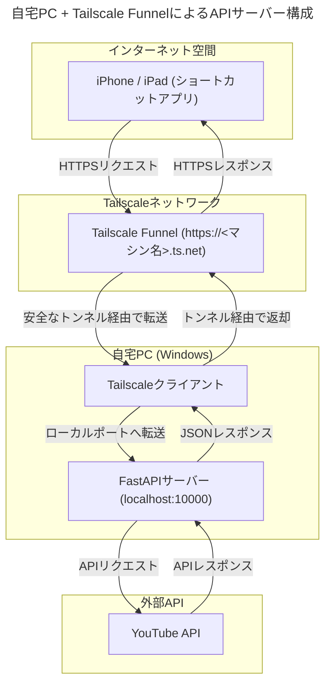

# 自宅PC + Tailscale FunnelによるAPIサーバー構築手順書

このドキュメントは、常時起動している自宅PCをAPIサーバーとして利用し、Tailscale Funnel経由でiPhoneやiPadから安全にアクセスするための設定手順をまとめたものです。

## 1. 全体構成



## 2. セットアップ手順

### A. 初回セットアップ（一度だけ実施）

#### 1. Tailscaleのインストール
- **PC**: [Tailscale for Windows](https://tailscale.com/download/windows) からインストーラーをダウンロードし、実行。Googleアカウント等でログインします。
- **iPhone/iPad**: App StoreからTailscaleアプリをインストールし、PCと同じアカウントでログインします。

#### 2. Python仮想環境のセットアップ
- プロジェクトフォルダでPowerShellを開き、以下のコマンドを順に実行します。
  ```powershell
  # 1. 仮想環境(.venvフォルダ)を作成
  python -m venv .venv

  # 2. 仮想環境を有効化 (プロンプトの先頭に (.venv) と表示される)
  .\.venv\Scripts\Activate.ps1

  # 3. 必要なライブラリをインストール
  pip install -r requirements.txt
  ```

### B. サーバー利用時の手順（毎回実施）

APIを利用したいときは、以下の2つのコマンドをそれぞれ別のPowerShellウィンドウで実行します。

#### 1. FastAPIサーバーの起動
- PowerShellを開き、以下を実行します。
  ```powershell
  # プロジェクトフォルダへ移動
  cd C:\Users\hirok\Documents\Windsurf\811【開発】\youtube_summary_api

  # 仮想環境を有効化
  .\.venv\Scripts\Activate.ps1

  # FastAPIサーバーを起動
  uvicorn main:app --host 127.0.0.1 --port 10000
  ```
- `Uvicorn running on http://127.0.0.1:10000` と表示されれば成功です。このウィンドウは開いたままにします。

#### 2. Tailscale Funnelの起動
- **別のPowerShellウィンドウを新しく開き**、以下を実行します。
  ```powershell
  & "C:\Program Files\Tailscale\tailscale.exe" funnel 10000
  ```
- `https://<あなたのPC名>.ts.net` というURLが表示されれば成功です。このウィンドウも開いたままにします。

### C. iPhone/iPadショートカットの設定

- ショートカットアプリのURLを指定するアクションで、ホスト名をFunnelで表示されたURL（例: `https://endoke-pc.tailee48cd.ts.net`）に書き換えます。
- APIキーやパス（`/api/v1/youtube/summary`など）は変更しません。

### D. サーバーの停止手順

- 利用が終わったら、サーバーとFunnelを起動している2つのPowerShellウィンドウで、それぞれ `Ctrl + C` を押してプロセスを停止します。
