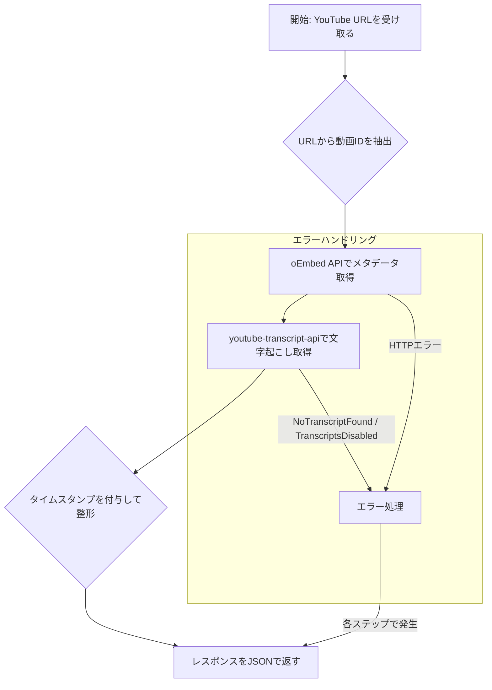

# YouTube動画の文字起こし取得における注意点と実装メモ

このドキュメントは、`youtube-transcript-api` を利用してYouTube動画のメタデータと文字起こしを取得するAPIを実装する際の、技術的な注意点やベストプラクティスをまとめたものです。

## 1. ライブラリの選定

- **メタデータ取得**: `pytube` は不安定な場合があるため、YouTube公式の **oEmbed API** を `requests` ライブラリ経由で利用することを推奨します。これにより、安定して動画タイトルやチャンネル名を取得できます。
- **文字起こし取得**: `youtube-transcript-api` は、多言語対応や自動生成された文字起こしの取得に優れており、非常に安定しています。

## 2. APIの処理フロー

APIの基本的な処理の流れは以下の通りです。



## 3. 文字起こしの整形とタイムスタンプ

`youtube-transcript-api` が返すデータは、各発言セグメントの辞書（`text`, `start`, `duration` を含む）のリストです。これをそのまま返すのではなく、ユーザーが利用しやすいように整形することが重要です。

### 実装のポイント

- **タイムスタンプのフォーマット**: `start`（秒数）を `[hh:mm:ss]` または `[mm:ss]` 形式の文字列に変換するヘルパー関数を用意します。
- **テキストの結合**: 各セグメントのテキストとフォーマットしたタイムスタンプを結合し、改行 (`\n`) で区切られた一つの文字列として提供します。これにより、可読性が向上し、クライアント側での処理も容易になります。

```python
def format_timestamp(seconds: float) -> str:
    """秒数を hh:mm:ss または mm:ss 形式に変換"""
    try:
        seconds = int(seconds)
        h = seconds // 3600
        m = (seconds % 3600) // 60
        s = seconds % 60
        if h > 0:
            return f"[{h:02d}:{m:02d}:{s:02d}]"
        return f"[{m:02d}:{s:02d}]"
    except Exception:
        return "[00:00]"

# ...

transcript_lines: list[str] = []
for item in transcript_list:
    start_time = item.get("start", 0)
    text = item.get("text", "")
    transcript_lines.append(f"{format_timestamp(start_time)} {text}")

transcript_text = "\n".join(transcript_lines)
```

## 4. エラーハンドリング

堅牢なAPIを構築するためには、予期せぬ事態に備えたエラーハンドリングが不可欠です。

- **`NoTranscriptFound`**: 動画に文字起こしが存在しない場合に発生します。`404 Not Found` を返すのが適切です。
- **`TranscriptsDisabled`**: 動画投稿者によって文字起こしが無効化されている場合です。これも `404 Not Found` として扱うのが一般的です。
- **HTTPエラー**: oEmbed APIへのリクエストが失敗した場合（例: 動画が非公開、削除済み）。YouTubeからのステータスコード（400, 403, 404など）をクライアントに中継するのが親切です。
- **その他の例外**: 予期せぬエラーは `500 Internal Server Error` として処理し、詳細をログに記録します。

## 5. セキュリティとデプロイ

- **APIキー**: APIを保護するため、リクエストヘッダー (`X-API-KEY` など) でAPIキーを検証します。キーの比較には `secrets.compare_digest` を使用し、タイミング攻撃への耐性を持たせます。
- **依存関係**: `requirements.txt` には、実際に使用しているライブラリのみを記載します。不要なライブラリ（例: `pytube`）は削除し、環境をクリーンに保ちます。
- **環境変数**: APIキーなどの機密情報は、`.env` ファイルやデプロイ先の環境変数で管理し、コードに直接ハードコードしないでください。
