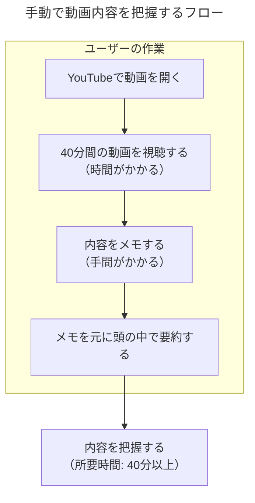
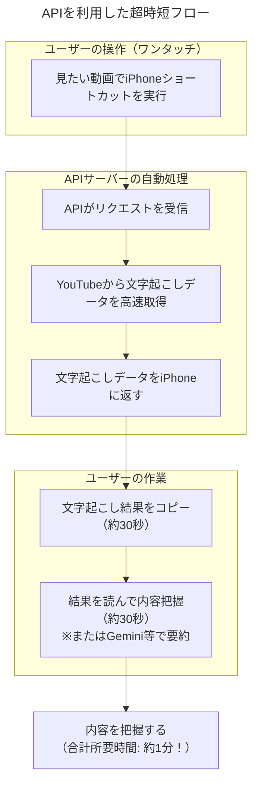
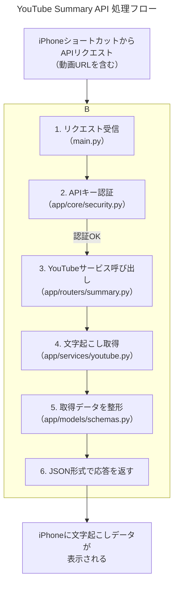

# YouTube動画の内容を"1分"で把握する超時短術

## はじめに

「この動画、気になるけど40分もあるのか...見る時間ないな」
「会議の録画、全部見返すのは大変だな...」

そんな経験はありませんか？

この資料では、当API「YouTube Summary API」を使って、**40分の動画の内容をたった1分で把握するための画期的な方法**をご紹介します。

## 課題：情報過多の現代、時間は有限

私たちは日々、多くの動画コンテンツに触れています。しかし、そのすべてをじっくり視聴する時間はありません。特に、学習や情報収集が目的の場合、動画の要点だけを効率的に知りたい、というニーズは非常に高まっています。

### 手動で内容を把握する場合の問題点

従来の方法では、動画の内容を把握するために多大な時間と労力が必要でした。

このように、**40分の動画なら、内容を把握するのに最低でも40分**はかかってしまいます。

## 解決策：APIで実現する「超」時短フロー

そこで登場するのが `YouTube Summary API` です。このAPIを使えば、面倒なプロセスを自動化し、劇的に時間を短縮できます。

### APIを利用した場合のフロー

iPhoneのショートカットアプリと連携すれば、ワンタッチで魔法のような体験が可能です。

手動では40分かかっていた作業が、**APIを使えばたったの1分**。これは、**97.5%もの時間削減**に相当します。

## APIの仕組み（少しだけ技術的な解説）

この時短を実現しているAPIの裏側を、少しだけ覗いてみましょう。

ユーザーが意識するのは最初の「ショートカット実行」だけ。あとはプログラムが全自動で処理してくれます。

1.  **リクエスト受信**: iPhoneから送られた動画URLを受け取ります。
2.  **APIキー認証**: 不正なアクセスを防ぐため、正しい利用者からのリクエストか確認します。
3.  **YouTubeサービス呼び出し**: 認証が通ったら、中核機能であるYouTubeの処理を開始します。
4.  **文字起こし取得**: `youtube_transcript_api`というライブラリを使い、YouTubeサーバーから動画の文字起こしデータを取得します。
5.  **データ整形**: 取得したデータを、プログラムで扱いやすいように決められた形式（スキーマ）に整えます。
6.  **応答を返す**: 整形したデータを、iPhoneが受け取れるJSONという形式で返します。

## まとめ

`YouTube Summary API` は、単なるプログラムではありません。情報収集のあり方を変え、あなたの貴重な「時間」を生み出すための強力なツールです。

-   **圧倒的な時短**: 40分の動画が1分に。
-   **シンプルな操作**: iPhoneショートカットでワンタッチ実行。
-   **高い汎用性**: 学習、議事録確認、情報収集など様々な場面で活躍。

ぜひこのAPIを活用して、より効率的で豊かな情報収集ライフを実現してください。 