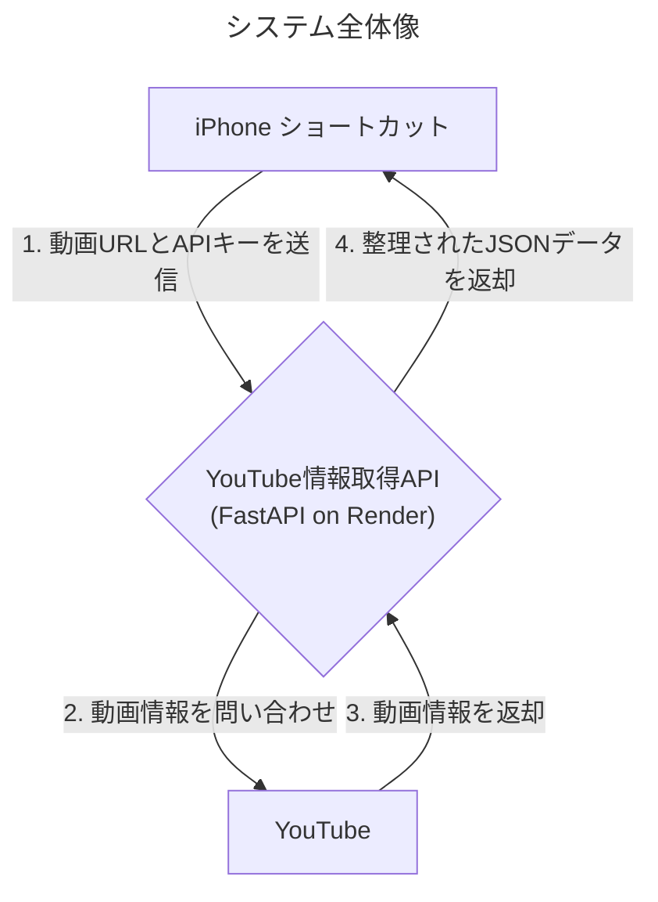
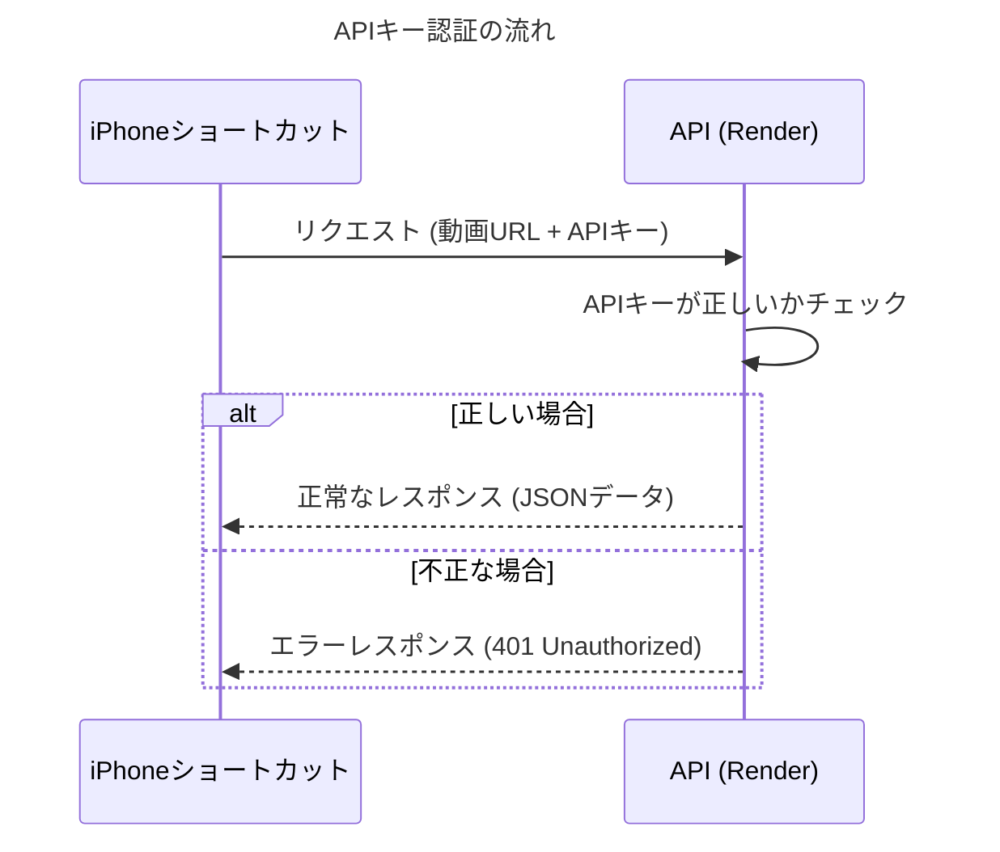

# YouTube動画情報取得API プロジェクト概要

**目的：YouTube動画の情報を手軽に取得し、要約作業を効率化する**

---

## 背景：現状の課題

- [[YouTube]]動画の情報を手動でコピー＆ペーストするのは手間がかかる
- タイトル、チャンネル名、再生数、文字起こしなど、複数の情報を集めるのが面倒
- この手作業を自動化し、もっと創造的な「要約」作業に集中したい

---

## 解決策：専用APIの開発

**[[iPhone]]のショートカットからワンタップで、必要な情報を一括取得するバックエンドAPIを開発します。**



---

## APIの主な機能

- **入力**: 1つの[[YouTube]]動画URL
- **処理**:
    1.  動画の基本情報（タイトル、チャンネル名、再生数など）を取得
    2.  動画の文字起こし（日本語）を取得
- **出力**: 上記の情報をまとめた[[JSON]]データ

---

## APIの返却データ (JSON形式)

```json
{
  "title": "動画のタイトル",
  "channel_name": "チャンネル名",
  "video_url": "https://www.youtube.com/watch?v=...",
  "upload_date": "2025-06-29",
  "view_count": 12345,
  "like_count": 1234,
  "subscriber_count": 5678,
  "transcript": "動画の文字起こし全文..."
}
```

---

## 技術スタック（使用する道具）

- **プログラミング言語**: `Python`
- **Webフレームワーク**: `FastAPI`
  - 高速でモダンなAPIを簡単に開発できる
- **実行環境（クラウド）**: `Render`
  - 無料プランがあり、手軽にAPIを公開できる
- **ソースコード管理**: `GitHub`
  - 開発の履歴を記録・管理する

---

## セキュリティ

- **APIキー認証** を採用します。
- 許可されたリクエスト（正しいAPIキーを持つもの）のみを受け付け、不正なアクセスを防ぎます。



---

## 開発の進め方（ロードマップ）

1.  **プロジェクトセットアップ** `(← 今ココ)`
    -   開発フォルダと[[GitHub]]リポジトリの準備
2.  **API基本機能の実装**
    -   [[YouTube]]から情報を取得するロジックを実装
3.  **Renderへのデプロイ**
    -   開発したAPIをクラウドに公開
4.  **動作テストと調整**
    -   [[iPhone]]ショートカットと連携し、動作を確認

---

## 次のステップ

**`01_プロジェクトセットアップ手順.md` に従って、[[GitHub]]リポジトリを作成し、URLを教えてください。**

そこから、ローカル環境と[[GitHub]]の連携に進みます。
