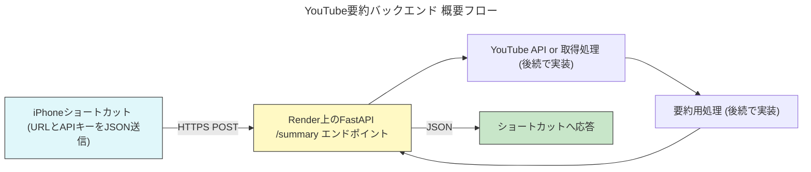

# Render で YouTube 要約 API バックエンドを構築する手順

> 最低限動作する **FastAPI** バックエンドを Render にデプロイし、iPhone のショートカットから `POST` で YouTube URL を送信すると JSON でレスポンスが返る構成を作成します。認証は **API Key (ヘッダー方式)** を採用します。

## 全体フロー（概要図）


---
## 1. 前提条件
1. GitHub アカウント（Render は Git リポジトリと連携して自動デプロイ）
2. Render アカウント（無料プランでOK）
3. ローカル開発用に Python 3.9+ / `pip` / `venv` が利用可能
4. Obsidian 上のこのフォルダに **コード以外(手順)だけ** を置き、実際のソースは別途 GitHub リポジトリに置くことを想定

---
## 2. GitHub リポジトリを準備
```bash
# 任意の作業ディレクトリで
mkdir yt-summary-api && cd yt-summary-api
python -m venv .venv
source .venv/bin/activate
pip install --upgrade pip
pip install fastapi uvicorn python-dotenv
```

### ディレクトリ構成（最低限）
```
yt-summary-api/
├── app/
│   ├── __init__.py
│   └── main.py  # エントリーポイント
├── .env.example # ローカル用サンプル
├── requirements.txt
└── README.md
```

### `requirements.txt`
```
fastapi
uvicorn[standard]
python-dotenv
```

### `app/main.py` (ミニマム実装)
```python
from fastapi import FastAPI, Header, HTTPException
from pydantic import BaseModel
import os

API_KEY = os.getenv("API_KEY")  # Render の環境変数に設定

app = FastAPI(title="YouTube Summary API", version="0.1.0")

class UrlRequest(BaseModel):
    url: str

@app.post("/summary")
async def summary(req: UrlRequest, x_api_key: str | None = Header(None)):
    if x_api_key != API_KEY:
        raise HTTPException(status_code=401, detail="Invalid API Key")

    # TODO: ここで YouTube から情報取得 & 要約処理
    return {"message": "URL 受領", "url": req.url}
```

### `.env.example`
```
API_KEY=your-secret-api-key
```

> `.env` (実ファイル) は **Git 追跡対象外** にしてローカルと Render の環境変数にだけ設定します。

```bash
# 必ず除外
echo ".env" >> .gitignore
```

---
## 3. GitHub へ Push
```bash
git init
git add .
git commit -m "Initial FastAPI skeleton"
git branch -M main
git remote add origin https://github.com/yourname/yt-summary-api.git
git push -u origin main
```

---
## 4. Render でサービス作成
1. Render ダッシュボード → **New** → **Web Service** を選択。
2. GitHub にログイン連携し、先ほどのリポジトリを選択。
3. 設定値
   - **Name**: 任意 (`yt-summary-api` など)
   - **Environment**: Python
   - **Build Command**: `pip install -r requirements.txt`
   - **Start Command**: `uvicorn app.main:app --host 0.0.0.0 --port 10000`
   - **Environment Variables**: `API_KEY=your-secret-api-key`
   - **Branch**: `main`
4. **Create Web Service** をクリック→ ビルド & デプロイが開始。

### デプロイ後の確認
- Render が発行する URL 例: `https://yt-summary-api.onrender.com`
- `GET /docs` を開くと Swagger UI が表示される。

---
## 5. 動作テスト
### cURL
```bash
curl -X POST \
  -H "Content-Type: application/json" \
  -H "X-API-KEY: your-secret-api-key" \
  -d '{"url":"https://www.youtube.com/watch?v=dQw4w9WgXcQ"}' \
  https://yt-summary-api.onrender.com/summary
```
- 期待レスポンス:
```json
{"message":"URL 受領","url":"https://www.youtube.com/watch?v=dQw4w9WgXcQ"}
```

### iPhone ショートカット
1. **URL** → `POST` アクション。
2. `Request Body` を `JSON` に設定し `{ "url": ShortcutInput }`。
3. **Header** に `X-API-KEY` = `your-secret-api-key` を追加。
4. レスポンスを受け取り、必要に応じて後続処理へ。

---
## 6. 今後の拡張ポイント
- YouTube Data API / 字幕 API を使用して動画情報・字幕を取得
- OpenAI 等で要約生成
- キャッシュ & 非同期処理による高速化
- 利用回数制限 (Rate Limit) の追加
- API Key を DB 管理して多ユーザ対応

---
## 参考リンク
- Render Docs: https://render.com/docs
- FastAPI: https://fastapi.tiangolo.com
- Curl コマンド入門: https://curl.se/docs
