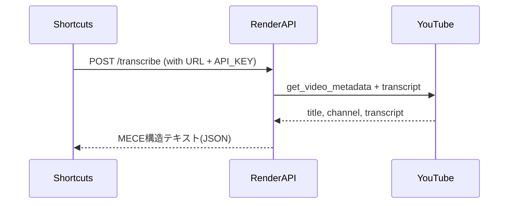

# RenderでバックエンドAPIを作成する手順

## 【前提】

- Renderアカウントは手持ち済み
- Python バックエンド (FastAPI)をデプロイ
- 相手は iPhoneショートカットから URL を POST

---

## 🧠 FastAPIとは？

**FastAPI（ファストエーピーアイ）** は、PythonでAPI（アプリとアプリの通信窓口）を素早く・簡単に作れる軽量なWebフレームワークです。

### 🔑 特徴

- **とても高速**（名前の通り）
- **書き方がシンプルで直感的**（Pythonらしい）
- **自動でAPIドキュメント生成（Swagger UI）**
- **入力チェックが厳密にできる**（型ヒントを使う）

### 🤝 何に使うの？

- 「URLにデータをPOSTして処理を返す」といった **APIサーバー** を簡単に作成可能。
- 今回のように：
  - YouTubeのURLを受け取り
  - 文字起こしを取得
  - 整形して返す という裏方処理に最適。

---

## 【ステップ1】: ファイル構成

```
project_root/
├── app.py                # FastAPI 本体
├── extractor.py         # YouTube文字起こし
├── config.py            # 設定
├── saved_prompt.txt     # MECE形式のプロンプト
├── requirements.txt     # ライブラリリスト
```

---

## 【ステップ2】: FastAPIコード (一例)

```python
# app.py
from fastapi import FastAPI, Header, HTTPException
from pydantic import BaseModel
from extractor import get_video_metadata, get_transcript
from config import PROMPT_FILE

app = FastAPI()

API_KEY = "your-secret-key"

class VideoURL(BaseModel):
    url: str

@app.post("/transcribe/")
def transcribe(video: VideoURL, x_api_key: str = Header(...)):
    if x_api_key != API_KEY:
        raise HTTPException(status_code=401, detail="Unauthorized")

    title, channel = get_video_metadata(video.url)
    transcript = get_transcript(video.url)

    with open(PROMPT_FILE, 'r', encoding='utf-8') as f:
        prompt = f.read().replace("{# 入力内容}", transcript).replace("（ここにタイトル）", title)

    return {"title": title, "channel": channel, "output": prompt}
```

---

## 【ステップ3】: requirements.txt を用意

```txt
fastapi
uvicorn
requests
youtube-transcript-api
python-dotenv
```

---

## 【ステップ4】: GitHubにプッシュ

1. ファイル一式を GitHub に push
2. `main` ブランチへ commit & push

---

## 【ステップ5】: Renderで Web Service 設定

1. Renderにログイン
2. "New Web Service" を選択
3. GitHubのリポジトリを選択
4. 設定:
   - **Build Command**: `pip install -r requirements.txt`
   - **Start Command**: `uvicorn app:app --host=0.0.0.0 --port=10000`
   - **Environment**: Python 3.10など
   - **環境変数**に `API_KEY` を登録

---

## 【ステップ6】: iPhoneショートカットの作成

1. アクション: URL を POST
2. ヘッダ設定: `X-API-Key: your-secret-key`
3. ボディ: `{ "url": "https://www.youtube.com/watch?v=xxxxx" }`
4. 返答: `output` を表示 / メモに保存

---

## 【流れ図 (Mermaid)】



---

## 【Tips】

- ステートコマンドのポート番号はRenderの環境変数で指定できる
- `.env` を使ってローカルで動作確認も可
- `https://your-service.onrender.com/transcribe` がショートカット側の登録URL

---

必要であれば、この手順書をPDFやObsidian用にも変換可能です。

